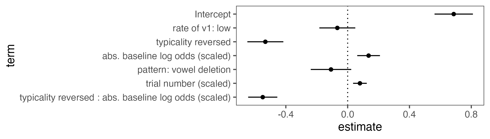
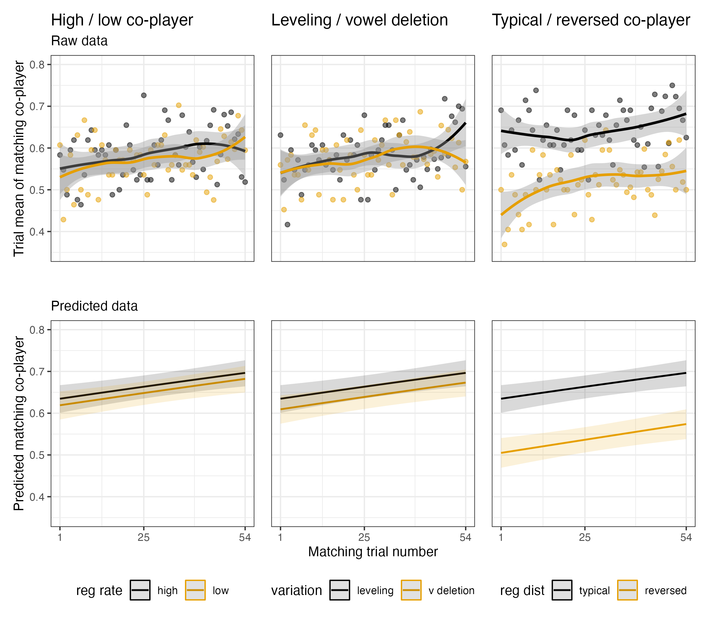
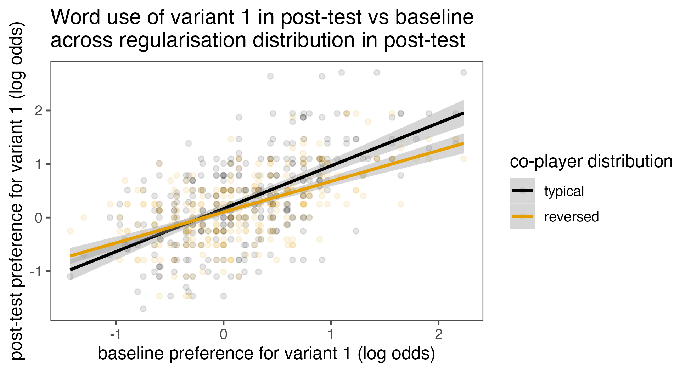
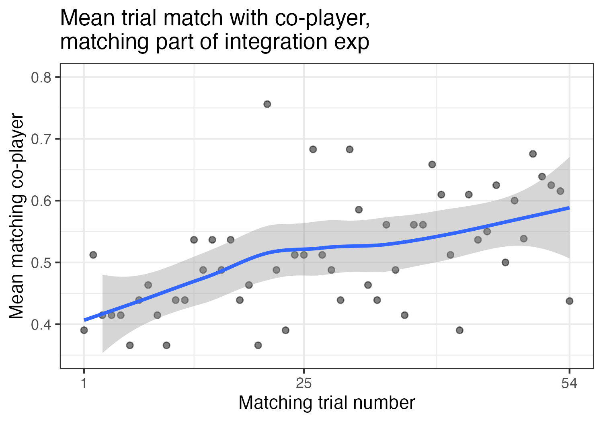
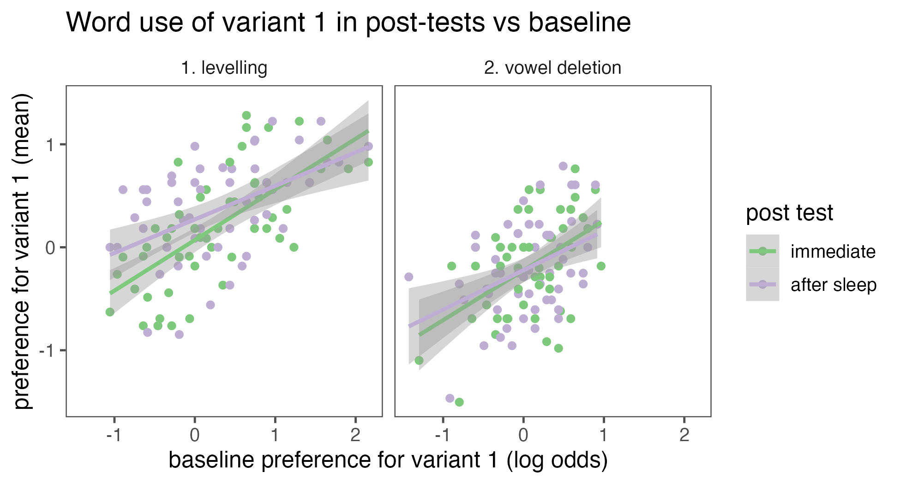

```{r setup, include=FALSE}
knitr::opts_chunk$set(echo = FALSE, warning = FALSE, error = FALSE, message = FALSE, fig.path = 'figures/', fig.width = 8, fig.height = 8)

googlesheets4::gs4_auth(email = 'petermartonracz@gmail.com')

set.seed(1337)

library(tidyverse)
library(glue)
library(magrittr)
library(knitr)
library(ggthemes)
library(lme4)

b = read_tsv('~/Github/Racz2024/exp_data/baseline/baseline_tidy_proc.tsv')
bd = read_tsv('~/Github/Racz2024/exp_data/baseline/baseline_tidy.tsv')
st = read_tsv('~/Github/Racz2024/resource/exp_input_files/esp/esp_master_input.tsv')
d = read_tsv('~/Github/Racz2024/exp_data/esp/esp_master_all_filtered.tsv')
allduf = read_tsv('~/Github/Racz2024/exp_data/esp/esp_master_all_unfiltered.tsv')
alldf = read_tsv('~/Github/Racz2024/exp_data/esp/esp_master_all.tsv')

iuf = read_tsv('~/Github/Racz2024/exp_data/esp/esp_master_sleep_pt1_pt2_all_unfiltered.tsv')
i = read_tsv('~/Github/Racz2024/exp_data/esp/esp_sleep_pt1_pt2_master_all_filtered.tsv')

levelling = read_tsv('~/Github/Racz2024/resource/real_words/ik_verbs/ikes_pairs_webcorpus2.tsv')
voweldeletion = read_tsv('~/Github/Racz2024/resource/real_words/epenthetic_stems/epenthesis_pairs_webcorpus2.tsv')
frontharmony = read_tsv('~/Github/Racz2024/resource/real_words/front_harmony/fh_pairs_webcorpus2.tsv')

esp_table = read_tsv('~/Github/Racz2024/analysis/esp_analysis/esp_fit.tsv')
posttest_table = read_tsv('~/Github/Racz2024/analysis/esp_analysis/posttest_fit.tsv')
esp2_table = read_tsv('~/Github/Racz2024/analysis/esp_analysis/sleep_analysis/esp2_fit.tsv')
posttest2_table = read_tsv('~/Github/Racz2024/analysis/esp_analysis/sleep_analysis/posttest2_fit.tsv')

d %<>% filter(variation %in% c('lakok/lakom','cselekszenek/cselekednek'))
allduf %<>% filter(variation %in% c('lakok/lakom','cselekszenek/cselekednek'))
alldf %<>% filter(variation %in% c('lakok/lakom','cselekszenek/cselekednek'))
```

# Summary

We wanted to see whether people can learn morphological variation and how the social salience of the pattern in question feeds into this. We selected a set of variable patterns in Hungarian morphology, generated nonce forms, benchmarked them in a baseline experiment, and then had our participants play a word-matching game with an artificial co-player to see whether they can learn from the co-player's responses in the game and adjust their representations of morphological variation, and whether the adjusted representations persist beyond the initial experiment.

Here, we give descriptions and report on the baseline experiment for three variable patterns, levelling, vowel deletion, and front harmony. We report on the main experiment and the integration experiment and provide a discussion for two of these patterns, levelling and vowel deletion.

The results confirm that participants have detailed representations of variable patterns and are able to adjust these upon exposure to external stimuli. Contrary to our expectations, this adjustment was not easier for the socially salient morphological pattern.

# Structure

There were three experiments. All experiments were coded in javascript and run remotely on the participant's home computer. The workhorse of the experiments was the written binary forced-choice trial, in which you see a written prompt and you have to finish it using one of two pre-set alternatives. 

The `baseline` experiment was used to benchmark the nonce-word stimuli with one sample of participants, so that we know that the participant pool prefers variant 1 for word x but variant 2 for word y. 

The `main` experiment (referenced as `esp`, after "extra-sensory perception", in the file structure) was run with a second set of participants. Its first half was a pretend matching game with a pretend second player. The two of you have to pick the same ending for each prompt. Since the second player is inflexible, you only succeed in the game if you anticipate their responses. Its second half was similar to the baseline experiment in that you have to pick alternatives to finish prompts by yourself. This is to check whether the patterns you learned in the first half persist once the second player disappears.

The `integration` experiment was run with a third set of participants. Its first part is the `matching` experiment, with the matching game and the immediate post-test. It also involved a second post-test, after a period of sleep.

The main questions of the paradigm are: Can people learn the morphological distributions fed to them in the matching game? Does this knowledge persist and influence their responses in the immediate post-test? Does it persist and influence responses in the second post-test, after considerable time has passed?

# Stimuli

There are three sets of stimuli, variable patterns from Hungarian morphology. `Baseline experiment` participants see examples from all three. Participants in the `main experiment` and the `integration experiment` only see one set of stimuli throughout.

## Variable patterns

We call the first pattern `levelling`. It involves verbal inflection. Hungarian inflects verbs with definite and indefinite objects differently. The `1sg.pres.indef` of some verbs varies between the `-k` inflectional suffix (which is the default for this exponent) and the `-m` suffix (which is otherwise the `1sg.pres.def` suffix) -- see examples 1-4. Levelling is confined to one verb class (verbs that end in `-ik` in the canonical form, the `3sg.pres.indef`) and one paradigm slot, not appearing outside the `1sg.pres.indef`. 

(1) **Nézem az almát.**  
`watch.1sg.pres.def the apple.acc`  
I watch the apple.

(2) **Nézek egy almát.**  
`watch.1sg.pres.indef an apple.acc`  
I watch an apple.

(3) **Eszem az almát.**  
`eat.1sg.pres.def an apple.acc`  
I eat the apple.

(4) **Eszek/eszem egy almát.**  
`eat.1sg.pres.indef an apple.acc`  
I eat an apple.

Many frequent verbs and many derivational suffixes are in the `-ik` category, meaning that levelling is productive and applies to a large number of frequent forms. It shows structured variation, sensitive to derivational morphology, frequency, and form-based similarity. It has no clear phonotactic or morphophonological triggers, any verb can end in `-k` or `-m` (as they do otherwise in the `indef` and the `def`, respectively). It is also has second-order indexicality: the neutralising `-m` variant is seen as educated, "proper" use ([Rácz 2019](https://www.jstor.org/stable/26863550)). 

We found `r nrow(levelling)` variable verbs in the Hungarian Webcorpus 2 (see below for details). Their distribution in our reference set can be seen in Figure 1. The figure shows the log odds of variant 1 over variant 2 across the forms in the webcorpus.

```{r levelling_dist}
levelling %>%
  ggplot(aes(log_odds)) +
  geom_histogram() +
  theme_few() +
  ggtitle('Figure 1: Levelling in the corpus: log odds of -k/-m forms')
```

A turn-of-the-century English analogy would be variation between `will` and `shall` in the first person, where `shall` was seen as more formal and educated but was also more likely to stand with certain more common verbs rather than others: compare "We shall see." with "I shall bicycle home.".

The second pattern is called `vowel deletion`. It also involves verbal inflection and is also confined to `-ik` verbs. These verbs end in two possible templates: CCik and CVCik. In certain cases, the vowel is deleted: Some verbs have a fixed CC template, others a fixed CVC template. Some verbs vary between CC and CVC across different paradigm slots (examples 5-6). Some verbs vary between CC and CVC in the same paradigm slot (example 7). This can be different paradigm slots for different verbs. Some instances of vowel deletion bring with themselves a change in the second consonant (example 7). Some cases of the pattern are lexicalised (example 8) ([Rácz, Rebrus, \& Törkenczy 2018](https://www.degruyter.com/document/doi/10.1515/cllt-2018-0014/html)).

(5) **Felsöpör.**  
`perf.sweep.3sg.pres.indef`  
(S)he sweeps up.

(6) **Felsöpri.**  
`perf.sweep.3sg.pres.def`  
(S)he sweeps it up.

(7) **Nem tudják, mit cselekszenek/cselekednek.**  
`neg know.2pl.pres.def what do.2pl.pres.indef`  
They know not what they do.

(8) **Ma az áldozatokra emlékezünk/emlékszünk.**  
`today the victim.pl.loc remember/commemorate.2pl.pres.indef`  
Today we remember/honour the victims.

The pattern is partly phonotactically and partly morphophonologically motivated. Certain pairs of consonants cannot occur adjacently in the stem unless they can be resyllabified, and this interacts with restrictions on the linking vowel in the suffix. In some verbs, this interaction leads to variable vowel deletion. In others, it cannot be resolved and results in morphological defectivity ([Rebrus \& Törkenczy 2009](https://www.researchgate.net/profile/Miklos-Toerkenczy/publication/299131111_Covert_and_overt_defectiveness_in_paradigms/links/56eee47608ae59dd41c7082b/Covert-and-overt-defectiveness-in-paradigms.pdf)). While subject to some metalinguistic awareness, vowel deletion does not carry any clear second-order indices and has not been discussed as a sociolinguistic marker in Hungarian.

We found `r length(unique(voweldeletion$base))` variable verbs in the Hungarian Webcorpus 2. The distributions of the CC / CVC forms in our reference set can be seen in Figure 2. The figure shows the log odds of variant 1 over variant 2 across the forms in the webcorpus. Here, more variable forms might belong to one verb, as the pattern is expressed across several paradigm slots (see below for more details).

```{r vd_dist}
voweldeletion %>%
  ggplot(aes(log_odds)) +
  geom_histogram() +
  theme_few() +
  ggtitle('Figure 2: Levelling in the corpus: log odds of cc/cvc forms')
```

Vowel deletion in rapid speech can be observed in spoken English: "family" or "natural" can be pronounced either as ['f6mIlI] or ['f6mlI] and ['n6t\@r\@l] or ['n6tr\@l]. This, however, is a lower-level phenomenon, gradient, closely related to vowel stress, not lexicalised, and not represented in the orthography.

The third pattern is called `front harmony`. Hungarian has vowel harmony: in most cases, the vowel in a suffix has to match the last vowel in the stem in both frontedness and roundness (examples 9-10). Some stem vowels are neutral, meaning that they do not determine the suffix vowel: Vowel harmony "skips" them and matches the suffix vowel to the preceding vowel in the stem (example 11). The vowel `e` is variably neutral: a stem with a back vowel and `e` can select a front suffix (agreeing with `e`) or a back suffix (skipping `e` and agreeing with the preceding back vowel) (example 12).

(9) **fójerben**  
`foyer.loc`  
In the foyer.

(10) **garázsnak**  
`garage.dat`
To the garage.  

(11) **partival**  
`party.ins`  
With the party.

(12) **hotelra/hotelre**  
`hotel.loc`  
On the hotel.

Hungarian vowel harmony and its triggers of variation have seen extensive scrutiny in the theoretical linguistics literature (see e.g. (Hayes, Siptár, Zuraw, \& Londe 2009)[https://www.jstor.org/stable/40492955]).

We found `r length(unique(frontharmony$stem))` variable bisyllabic nouns in the Hungarian Webcorpus 2. The distributions of the back / front forms in our reference set can be seen in Figure 3. The figure shows the log odds of variant 1 over variant 2 across the forms in the webcorpus. Again, here, more variable forms might belong to one noun, as the pattern is expressed across several cases (see below for more details).

```{r fh_dist}
frontharmony %>%
  ggplot(aes(log_odds)) +
  geom_histogram() +
  theme_few() +
  ggtitle('Figure 3: Levelling in the corpus: log odds of back/front forms')
```

## Experimental stimuli

We compiled a frequency list from the morphologically disambiguated [Hungarian Webcorpus 2](https://hlt.bme.hu/en/resources/webcorpus2). This was used to curate reference lists of existing forms for the three patterns. The reference lists were generated by creating variable forms by hand, and cross-referencing them with the frequency list and a [spelling dictionary](https://github.com/laszlonemeth/magyarispell).

The next step was to use the reference sets to generate nonce forms for each pattern. Because both vowel deletion and front harmony involve longer dependencies in the CV skeleton, off-the-shelf ngram models were not sufficient to generate nonce forms. Instead, we wrote a simple grammar that breaks up the words on the reference list into syllable-based units and generates noun and verb forms. We checked the output by hand. The resulting lists were filtered so that each nonce word in each pattern (levelling, vowel deletion, front harmony) had an edit distance of 2 or more with words in the reference set and with each other. Since the language has digraphs in the orthography, edit distance was based on a phonemic transcription of contrastive segments.

The final stimuli list was further restricted to vary across set dimensions. Levelling is restricted to the `1sg.indef`. Each nonce form had a mono- or bisyllabic stem and a derivational suffix. Hungarian verbs are a closed class, and new verbs enter the language via derivational morphology, using one of several possible derivational suffixes (see examples 13-15).

(13) **guglizik**  
`google.v.der.3sg.pres.indef`  
(S)he googles.

(14) **dúmozik**  
`doom.v.der.3sg.pres.indef`  
(S)he plays the video game Doom.

(15) **solymászik**  
`falcon.v.der.3sg.pres.indef`  
(S)he falcons.

A set of examples for levelling can be seen in Table 1.

```{r nonce_examples_1}
b %>% 
  filter(variation == 'lakok/lakom') %>% 
  mutate(infl = '1sg') %>% 
  group_by(derivational,nsyl,infl) %>% 
  select(base,variant1,variant2,derivational,nsyl,infl) %>% 
  sample_n(1) %>% 
  kable('simple', caption = 'Table 1. Levelling: example stimuli')
```

For vowel deletion, which occurs across many paradigm slots, variation was restricted to the , `2pl.pres.indef`, and `3pl.pres.indef`. Otherwise, the structure was similar to levelling, with mono- or bisyllabic stems and the same three derivational suffixes. A set of examples for vowel deletion can be seen in Table 2.

```{r nonce_examples_2}

b %>% 
  filter(variation == 'cselekszenek/cselekednek') %>% 
  mutate(infl = case_when(
    suffix == 'ünk' ~ '1pl',
    suffix == 'nek' ~ '2pl',
    suffix == 'tek' ~ '3pl'
  )) %>% 
  group_by(derivational,nsyl,infl) %>% 
  select(base,variant1,variant2,derivational,nsyl,infl) %>% 
  sample_n(1) %>% 
  kable('simple', caption = 'Table 2. Vowel deletion: example stimuli')
```

For front harmony, all stems were bisyllabic, with a back vowel and the variable neutral vowels `e` or `é`. Many case markers show variation. Here, the pattern was restricted to the inessive, the dative, and the adessive. A set of examples for front harmony can be seen in Table 3.

```{r nonce_examples_3}

b %>% 
  filter(variation == 'hotelban/hotelben') %>% 
  mutate(decl = case_when(
    suffix == 'ban' ~ 'in',
    suffix == 'nak' ~ 'dat',
    suffix == 'nál' ~ 'ad'
  )) %>% 
  group_by(vowel,decl) %>% 
  select(base,variant1,variant2,vowel,decl) %>% 
  sample_n(1) %>% 
  kable('simple', caption = 'Table 3. Front harmony: example stimuli')
```

Three sets of 162 forms each were created, balancing across the restrictions above. For each target nonce word in each variable pattern, there are two possible alternatives for variants: `-k` or `-m` for levelling, `cc` (vowel deleted) or `cvc` (vowel in situ) for vowel deletion, and back vowel or front vowel in suffix for front harmony.

## Data and code

Code used to set up the reference lists of real words is in `scripts/build_words/build_real_list/build_real_word_lists/`. Code used to generate nonce words is in `scripts/build_words/build_nonce/list/`. The original webcorpus frequency list and the processed lists are in `resource`. In the code, levelling is `ik`, vowel deletion is `ep` and front harmony is `vh`.

# Baseline experiment

## Stimuli

Each set of 162 stimuli were split into three lists. Each participant was randomly given one list for each variable pattern (levelling, vowel deletion, front harmony), 162 stimuli in total, in random order, not in blocks. Each stimulus was embedded in a prompt that the participant had to complete using one of two alternatives. The prompt was fixed across variable pattern and inflectional or declension suffix. The prompt ending unequivocally selects for a specific verb/noun complement. The two variants of this complement are specified as the two alternatives in the forced-choice task. Example prompts can be seen in Table 4.

```{r ex_prompts}
b %>% 
  group_by(variation,suffix) %>% 
  sample_n(1) %>% 
  ungroup() %>% 
  mutate(
    prompt = glue('{carrier_sentence} {target_sentence}'),
    variation = factor(variation, levels = c('lakok/lakom','cselekszenek/cselekednek','hotelban/hotelben'))
    ) %>% 
  arrange(variation) %>% 
  select(prompt,variant1,variant2) %>% 
  add_column(gloss = c(
    'You do frequently VERB. I also frequently...',
    'John loves to CVC VERB so he frequently CC VERB. They rarely...',
    'John loves to CVC VERB so he frequently CC VERB. You rarely...',
    'John loves to CVC VERB so he frequently CC VERB. We rarely...',
    'This is a NOUN. We are there in the...',
    'This is a NOUN. I named my dog...',
    'This is a NOUN. Nothing better than a good...'
      ),
    `variable pattern` = c('levelling',rep('vowel deletion',3), rep('front harmony',3))
    ) %>% 
  kable('simple', caption = 'Table 4. Example prompts across pattern and suffix')
```

## Participants

```{r baseline_sum}
b1 = length(unique(bd$file_name))
b2 = bd %>% 
  distinct(file_name, `Mi a nemed?`) %>% 
  count(`Mi a nemed?`) %>% 
  filter(`Mi a nemed?` == 'nő') %>% 
  pull(n)
b3 = bd %>% 
  distinct(file_name, `Melyik évben születtél?`) %>% 
  summarise(median = 2022 - median(`Melyik évben születtél?`, na.rm = T)) %>% 
  pull(median)
b4 = range(b$resp1+b$resp2)
b5 = median(b$resp1+b$resp2)
b6 = bd %>% 
  group_by(file_name) %>% 
  summarise(sum = sum(keyboard_input.rt)/60) %>% 
  summarise(median = median(sum))

```

`r b1` participants, `r b2` women, median age = `r b3` took part in the baseline experiment in early 2022, participating for course credit. 

## Procedure

The task was coded in [psychojs](https://www.sciencedirect.com/science/article/pii/S0165027006005772) and hosted on [Pavlovia](pavlovia.org). Participants were instructed that they would see prompts that contain words that might be unfamiliar to them. They were asked to pick a suffixed form to finish the prompt in a way that seems most natural or familiar to them. They were informed that different people might have different preferences and there are no correct or incorrect answers. An example preceded the trials. Participants used the keyboard to respond.

## Hypotheses

The aim of the task was to benchmark our stimuli. There were no starting hypotheses on the distributions.

## Analysis

Participants who only picked the left button or the right button were to be excluded from the data. No participants met this pre-registered exclusion criterion.

## Results

Participants completed the task in a median `r b6` minutes. Given the randomisation, the number of responses per nonce word was not the same. Participants gave `r b4[1]`--`r b4[2]` responses to each nonce form, with a median of `r b5`. The three stimulus lists did not differ significantly in preference for variant 1 / 2 (based on a binomial GLMM predicting probability of variant 1 from list number with participant and target word grouping factors).

For each nonce form, we calculated the log odds of the counts of participants who picked variant 1 and those who picked variant 2.

```{r baseline_model, eval = F}
fit_b = glmer(resp_is_first_variant ~ 1 + my_list + (1|file_name) + (1|prompt), data = bd, family = binomial)
```

## Data and code

Code used to set up and process the experiment is in `scripts/baseline_exp`. The code to run the experiment is in `interface/hesp_baseline.zip`. Raw data are in `exp_data/raw`, tidy data are in `exp_data/baseline`.

## Ethics

Participants gave informed consent at the beginning of the experiment. The study was approved by the United Ethical Review Committee for Research in Psychology in Hungary (EPKEB, ref.\ number 2021-119).

# Main experiment

The sample size, design, exclusion criteria, and data analysis were [pre-registered](https://aspredicted.org/BL1_S7V). We only report the levelling and vowel deletion data.

## Stimuli

The matching game is played with a co-player and the participant has to match the co-player in finishing the prompt. If the two alternatives are A and B, the participant has to anticipate whether the co-player would pick A or B and choose accordingly. This is initially impossible, but, as the game goes along, the participant can build on trial feedback to better anticipate what the co-player might pick next. By manipulating the co-player's responses, we can feed different morphological distributions to the participant. 

The post-test has the participant playing alone, in order to ascertain whether they still show an influence of the matching game. One participant sees words from one type of pattern only (levelling / vowel deletion), both in the matching game and the post-test. One participant sees different words in the matching game and in the post-test.

We created three lists of 54 items each for each pattern, sampled from the baseline. In each list, nonce forms were ranked from 1 (highest baseline preference for variant 1) to 54 (lowest baseline preference for variant 1). Co-players used the baseline patterns as a reference. They diverged from them across two dimensions.

Co-players had a **high** rate of use for variant 1 (and, correspondingly, a low rate of use for variant 2) or a **low** rate of use for variant 1 (and a high rate for variant 2). **High** meant they picked variant 1 in 39/54 trials (72%). **Low** meant they picked variant 1 in 15/54 trials (28%).

Co-players didn't pick forms at random. The lists were sorted according to rank, going from words that showed the highest preference for variant 1 to those that showed the lowest preference for variant 1. One set of co-players selected the first 39 forms (in the **high** condition) or the first 15 forms (in the **low** condition) and then went on to pick variant 1 for these. This meant that these co-players acted like our average baseline participant, apart from having a quantitative preference for lots of variant 1 or few of variant 1. These were **typical** co-players.

Another set of co-players reversed the list and picked variant 1 for the words that were least likely to show it in the baseline. Effectively, these co-players gave responses that were the opposite of the expectations of an average baseline participant. These were **reversed** co-players.

Table 5 illustrates this. It shows the items on list 1 for the levelling pattern, sorted from strongest preference for variant 1 ("tomlik") to weakest preference for variant 1 ("spilágzik"). A co-player with **high** preference for variant 1 and a **typical** distribution will pick the first variant, `-k` for the first 39 verbs and the second variant, `-m`, for the last 15. A co-player with **low** preference for variant 1 and a **typical** distribution will pick `-k` for the first 15 verbs and `-m` for the last 39. Both will pick `-k` for verbs that strongly prefer `-k`. 

A co-player with **high** preference for `-k` and a **reversed** distribution will use the list upside-down and pick `-k` for the last 39 verbs and `-m` for the first 15 verbs. A co-player with **low** preference for `-k` and a **reversed** distribution will pick `-k` for the last 15 verbs and `-m` for the first 39 verbs. Both will pick `-k` for verbs that strongly reject `-k`.

```{r matching_list_ex}
# unique(st$file_name)

t5 = st %>% 
  filter(str_detect(file_name,'lakok_1')) %>% 
  mutate(
    interaction = interaction(reg_rate, reg_dist, sep = ' '),
    esp_response_bold = str_replace_all(esp_response, c("k$" = "**k**", "m$" = "**m**"))
    ) %>% 
  select(interaction,base,log_odds,esp_response_bold) %>% 
  pivot_wider(names_from = interaction, values_from = esp_response_bold) %>% 
  arrange(-log_odds) %>% 
  mutate(`baseline rank` = 1:n()) %>% 
  select(`baseline rank`, log_odds, base, `high typical`, `low typical`, `high reversed`, `low reversed`)

t5 %>%  
  kable('simple', digits = 2, caption = 'Table 5. Levelling list 1 across co-player types')

t5b = t5 %>% 
  map_df(~ str_replace_all(., '\\*\\*', '')) %>% 
  mutate(`baseline log odds of k/m` = round(as.double(log_odds),2)) %>% 
  slice(1,seq(6,54,6)) %>% 
  select(-log_odds) %>% 
  relocate(`baseline log odds of k/m`, .after = `baseline rank`) 

t5b %>% 
  googlesheets4::write_sheet(ss = 'https://docs.google.com/spreadsheets/d/1ma5XC56IaMwgCfdpEDL_nUlGcjPigz8VLeH3UcRossM/edit?usp=sharing', sheet = 'Table 1')

# t5b %>% 
#   kable('latex')

```

The second part of the main experiment is a post-test. It tests whether the participant maintains the patterns learned in the matching game. Participants were allocated to lists and conditions at random. If a participant had list 1/2/3 in the matching game, they had list 2/3/1 in the post-test.

There were three lists and all four co-player types played all lists, resulting in 12 unique lists in total. The pre-registration specifies 50 trials, the experiment had 54 trials.

Participants saw words in a random order in both the matching game and the post-test. The order of variants in each trial was also randomised.

## Participants

```{r esp_sum}
# beware: columns have different names in baseline and matching/esp data

d1 = length(unique(allduf$dat_id))
d1b = length(unique(d$dat_id))
d1c = length(unique(alldf$dat_id))
d2 = d %>% 
  distinct(dat_id, part_gender) %>% 
  filter(str_detect(part_gender, 'ő')) %>% 
  nrow()
d3 = d %>% 
  distinct(dat_id, record_date, part_yob) %>% 
  mutate(
    year = lubridate::year(record_date),
    age = year - as.double(part_yob)
         ) %>% 
  summarise(median = median(age, na.rm = T)) %>% 
  pull(median)
d4 = d %>%
  group_by(part_id) %>% 
  summarise(all_rt = sum(rt)) %>% 
  ungroup() %>% 
  summarise(median = median(all_rt)/1000/60) %>% 
  pull(median)

```

`r d1` participants completed the main experiment in late 2022 and early 2023. Sample size was pre-set to 7 per unique list (12 lists) or 21 per condition (high / low x typical / reversed x levelling / vowel deletion). `r d1-d1c `participants who matched our exclusion criteria (see below) were excluded. Then, we kept data from the first seven participants in each list (excluding an additional `r d1c-d1b` participants), resulting in a final total of 7 x 3 x 2 x 2 x 2 = `r d1b` participants, `r d2` women. Median age was `r d3`. Participants completed the task for course credit.

## Procedure

The task was coded in [jspsych](jspsych.org) and hosted on Pavlovia. Participants were instructed that they would see prompts that contain words that might be unfamiliar to them. They were asked to pick a suffixed form to finish the prompt in a way that seems most natural or familiar to them. They were informed that different people might have different preferences and there are no correct or incorrect answers. An example preceded the trials. Participants used the mouse and on-screen buttons to respond.

Participants were also instructed that they play this game with another player. The other player always has the same alternatives as them. Their joint task is to choose the same alternative in each trial. Participants were instructed that, in order to do so, they have to pay attention to the other player's answers and guess how they will choose next. If they get it right, they get a point.

After an example trial, participants were informed that they would be connected to the other player. This was followed by a delay of circa five seconds during which the message "connecting to the other player..." was seen on the screen, followed by a brief message saying "connection successful".

Each matching game trial had the same forced-choice format as the baseline task except that participants had to click on buttons instead of using the keyboard. In each trial, the other player would "think" for a random interval in the range of 3-9 seconds, during which the message "the other player is thinking" was visible above the trial prompt. If the participant chose during this time, they had to wait for the other player to "finish" the trial. If the participant did not choose during this time, the message "the other player took a pick" became visible. Once the participant made their choice, they were informed about the co-player's choice and whether it matched their own. A match was rewarded with a green tick and the message "you matched the other player". A mismatch was rewarded with a red X and the message "you did not match the other player". In addition, a match awarded a point and the current joint score of the player and the co-player was displayed on the screen.

After the matching game, the participant was instructed to do the same task, to finish prompts, but, this time, without the co-player. Once the participant finished this post-test, a message informed them of their final score. Score had no effect on the game or on participant compensation.

## Hypotheses

We expected people to (1) learn in the matching game and become better at predicting the co-players answers. We expected (2) learning to persist in the post-test so that patterns in the post-test are similar to patterns in the matching game. We expected that (3) learning will be easier and persistent effects stronger for the socially salient pattern, levelling, as compared to vowel deletion.

We do not know the priors of the participants. Some of them likely have a high or low preference for variant 1 themselves. We do know the priors for the target words, based on the baseline task.

In terms of (1) learning, we can see how well participants converge to various co-players across levelling or vowel deletion stimuli. In terms of (2) persistent effects, we can look at differences in post-test responses across target words and participants in the various co-player conditions (high / low, typical / reversed, levelling / vowel deletion).

## Analysis

Participants who only picked the left button or the right button were to be excluded from the data. No participants met this pre-registered exclusion criterion. Participants who finished either the matching game or the post-test slower than the median completion time plus three times the mean absolute deviation of completion times were excluded. Individual trials that had a longer response time than the median response time plus three times the mean absolute deviation of response times were also excluded. Median and mean absolute deviation were calculated separately for type of pattern (levelling / vowel deletion) and phase (matching game or post-test).

`r 18144-nrow(d)` trials or `r (1-(nrow(d)/18144))*100`% of all trials were dropped. This is a relatively high number. This is likely both because the task was difficult and because participants completed it in an uncontrolled environment, both contributing to higher variability. Participants completed the matching game and the post-test in 10-15 minutes.

### Matching game

We fit a generalised additive mixed model ([Wood 2023](https://cran.r-project.org/web/packages/mgcv/index.html)) on the matching data. The outcome variable was agreement with the co-player. The predictors were trial index, rate of use of variant 1 (high / low), distribution of use of variant 1 (typical / atypical), type of pattern (levelling / vowel deletion), and the log odds of the number of variant 1 and variant 2 responses to the target form in the baseline task. Grouping factors were participant and target form. Models were fit using restricted maximum likelihood, a binomial error distribution, and a logit link function. We did not drop terms and instead explored all interactions and used goodness-of-fit tests and AIC for model comparison ([van Rij 2022](https://www.rdocumentation.org/packages/itsadug/versions/2.4.1)).

The best model had a linear effect of trial index and a quadratic effect of baseline log odds of variant 1 / variant 2. Random smooths did not improve model fit. We re-fit it as a generalised linear mixed model with a linear effect of trial index and a linear effect of the absolute baseline log odds of variant 1 and variant 2. We report and provide criticism for this model below.

### Post-test

We fit a generalised linear mixed model ([Bates 2023](https://cran.r-project.org/web/packages/lme4/index.html)) on the post-test data. The outcome variable was selecting variant 1. The predictors were rate of use of variant 1 (high / low), distribution of use of variant 1 (typical / reversed), type of pattern (levelling / vowel deletion), and the log odds of the number of variant 1 over variant 2 responses to the target form in the baseline task. Grouping factors were participant and target form. Models were fit using restricted maximum likelihood, a binomial error distribution, and a logit link function. The post-test analysis was pre-registered. We did not drop terms and instead explored all interactions and used goodness-of-fit tests, AIC, and BIC for model comparison. We used the performance package ([Lüdecke 2023](https://cran.r-project.org/web/packages/performance/index.html)) to check model health and to compare models.

The model of the matching game data was largely exploratory. The model of the post-test data was pre-registered, down to interactions and random effect structure, with the notable difference that the final analysis uses frequentist, rather than Bayesian methods. The main advantage of Bayesian statistics is that frequentist models often result in errors of magnitude by overfitting the data. The use of pre-registered sample size, exclusion criteria, and model structure, along with AIC and BIC to detect overfitting, largely mitigates this problem.

The best model had an interaction of baseline log odds and co-player typicality. Random slopes did not improve this model. We report and provide criticism for this model below.

## Results

### Matching game

The formula for the best model is `p(match co-player) ~ 1 + reg_rate + reg_dist * scale(abs_baseline_log_odds_jitter) + pattern + scale(i) + (1|part_id) + (1|base)`. The outcome is the probability of matching the co-player. The summary of the fixed effects is in Table 6.



The intercept is above zero with a 95% confidence interval that excludes zero. This means that participants are, overall, above chance in matching the co-player in the 54 trials of the matching phase. Of the predictors, (scaled) trial number, reversed co-player typicality and (scaled) target word absolute baseline log odds have a significant effect on match success. We now look at these in detail.

Figure 4 shows mean predicted match across trial number in three splits: high / low use of variant 1 (left), typical or reversed co-player distribution (middle), and matching in levelling or vowel deletion stimuli (right).

The horizontal axis is trial number, going from the first to the last matching game trial. The vertical axis is rate of predicted overall agreement with the co-player in each trial. The dotted lines are standard errors. We see that participants are more likely to match the co-player in later trials across the board. This shows that participants learn in the matching game. They are more likely to match the co-player in the end than in the beginning. Learning has a linear trajectory. The data do not support a non-linear learning trajectory nor across-participant variation in the shape of the learning trajectory. Participants have different random intercepts. Various conditions have meaningfully different fixed intercepts. The direction and linearity of the learning curve is always the same.



Looking at the left-hand side, learning is not harder with either a high or low rate of variant 1.

Looking at the middle, we see the only statistically significant difference: between the intercepts of matching a typical versus a reversed co-player. Matching a typical co-player is much easier right from the beginning. In contrast, participants are less likely than chance to match the reversed co-player initially. This demonstrates that learning goes beyond picking up on a rate of use for variant 1 / variant 2. If a co-player's choices reflect the baseline distribution of preference for variant 1 / variant 2, participants are much more likely to match the co-player right away. This then improves, likely because participants can adjust their expectations on the rate of use for variant 1 (high or low) on top of the typical distribution.

In contrast, when a co-player's choices are counter-intuitive, participants start out mismatching the co-player. They then gradually adjust to the co-player's distribution, resulting in some improvement in matching.

It is possible that learning trajectories are not completely homogenous and linear in the population and the data do not provide us with enough evidence to reject uniform slopes and linearity. At the same time, word-level distributions in both the matching game and the post-test suggest gradual convergence with the co-player across trials and lexical items (see below).

Looking at the right-hand side, we see that learning is no easier with the socially more salient variable pattern, levelling. Despite the clear second-order indices of levelling and the relative heterogeneity of vowel deletion, participants are equally capable of picking them up.

One interaction in the model is between the baseline log odds of the target word in the prompt and co-player typicality. This can be seen in Figure 6. The horizontal axis shows the absolute log odds of picking variant 1 in the baseline. If this number is near zero, baseline participants showed no strong preference for variant 1 or variant 2 (since the plogis of 0 is .5). If it is a large number, baseline participants showed a strong preference for variant 1 (a large positive log odds) or variant 2 (a large negative log odds). The vertical axis is the predicted probability of matching a co-player in the matching game.

When we look at the left-hand panel, we see how these two correlate when playing a typical co-player. What we see here is a reflection of the design: both "high" and "low" co-players pick variant 1 for words where variant 1 is strongly preferred in the baseline, and the same is true for variant 2. These are the words with high absolute baseline log odds. They behave in a very specific way, this is largely reinforced by the co-player, and matching them is easier.

When we look at the right-hand panel, we see a different pattern emerge with a reversed co-player. If the absolute baseline log odds of a word is large, that means it has a clear preference for variant 1 or variant 2. The reversed co-player will pick the opposite variant. Matching the reversed co-player, then, will be harder. The more a nonce word behaves in a specific way "in general", the harder it gets to match the reversed co-player who goes against this general trend.

This, again, shows that participants have word-level expectations on whether variant 1 or variant 2 is more "appropriate". A co-player that respects these expectations is easier to match. A co-player that violates them is harder to match. Here again we see a linear trajectory: for any given word, the larger the baseline preference for variant 1 or variant 2, the harder it is to match a reversed co-player's pick. This ties in with the linear learning trajectory: participants seem to adjust their representations of the co-player one word and one trial at a time. 

The results show that matching becomes easier in the course of the matching game and that reversed co-players are harder to match than typical ones, demonstrating an effect of word-level expectations (above and beyond overall expectations on the rate of use for variant 1 or variant 2). Curiously, learning is not easier with the socially salient variable pattern.

### Post-test

The best model for the post-test is `p(pick variant 1) ~ 1 + reg_rate + reg_dist * baseline_log_odds_jitter + pattern + (1 + 1|part_id) + (1|base)`. Since there is no co-player here to match, the outcome is the probability of picking variant 1. The summary of the fixed effects is in Table 7.

```{r pt_fit}
posttest_table %>% 
  filter(effect == 'fixed') %>% 
  rename(term2 = term) %>% 
  add_column(term = c('Intercept','rate of v1: low','typicality reversed','baseline log odds','pattern: vowel deletion', 'typicality reversed : abs. baseline log odds (scaled)')) %>% 
  select(term,estimate,std.error,statistic,conf.low,conf.high) %>% 
  kable('simple', digits = 2, caption = 'Table 7. Best model, post-test in main experiment')
```

The intercept is above zero and the effect of low co-player rate of use of variant 1 is negative. This means that participants use a high amount of variant 1 in the post-test if they played a "high" co-player and a low amount if they played a "low" co-player. Target word baseline log odds of use of variant 1 is a strong predictor of post-test use of variant 1, meaning that these participants have similar expectations about the target words as our baseline participants. 

Since the outcome variable here is use of variant 1, we do not expect co-player typicality and variable pattern to have a single-term effect. We are interested in interactions between terms. The one significant interaction is between target word baseline log odds of use of variant 1 and co-player typicality. We explore this below.

Essentially, participants maintain the patterns they learned in the matching phase. A clear example of this is that participants who played a high 1 co-player will have a higher use of variant 1 in the post-test than those who played a low 1 co-player.

The persistent adjustment goes beyond a shift in the rate of use of variant 1 and variant 2. This can be seen in Figure 5. The horizontal axis shows the baseline log odds of the use of variant 1 for each word and the vertical axis shows the mean predicted rate of use of variant 1 in the post-test. The two are correlated: participants in the post-test make similar choices to participants in the baseline experiment. 

The strength of the correlation is significantly different depending on the type of co-player in the matching game: the choices of participants playing a reversed co-player have a weaker correlation with the baseline pattern. This is because we exposed these participants to a different lexical structure. Participants playing a typical co-player received evidence that supports their own lexical structure. Participants playing a reversed co-player received evidence that words that, in their judgement, prefer variant 1 in fact strongly prefer variant 2, and, conversely, those that should prefer variant 2 in fact prefer variant 1. As a result, these participants adjusted their lexical patterns. Words that had a low preference for variant 1 now have a higher preference. Words that had a high preference for variant 1 now have a lower preference. The result is the difference in the rates of correlation across co-player typicality, seen in Figure 5.



This effect is independent of whether the co-player had a high or low overall preference for variant 1. This also makes sense: half of the participants have seen a co-player with a high overall rate of variant 1 and half of the participants have seen a co-player with a low overall rate of variant 1 and the two groups average out. More interestingly, the variable pattern also makes no difference. This can be seen in Figure 6.

Figure 6 shows the correlation of baseline log odds with predicted mean rate of use of variant 1 in the post-test for each word, this time split across participants with typical and reversed co-players. The slope of the correlation is not different between participants who were exposed to levelling stimuli versus vowel deletion stimuli, either for the typical or the reversed co-player. This means that not only are the rates of learning similar for the two variable patterns, the learned lexical structure is retained to a similar extent in the post-test.


## Discussion

We reported the results of an experiment in which we expose participants to a pattern of variation which is expressed over benchmarked nonce word stimuli but is based on existing variation in their native language. We do so using a matching game in which they have to agree with an artificial co-player in picking one variant out of two for a morphological exponent. Both variants are well-formed according to the conventions of the language. The co-player made decisions based partly on patterns in the ambient language and partly based on condition-based manipulations. Participants were incentivised to learn the pattern and the question was whether its various attributes made it easier or harder for them to do so.

Our participants learned the variable patterns. They improved in matching the co-player over the course of the matching game and their subsequent post-test responses sorted them in groups depending on what kind of co-player they had just seen. Learning did not solely consist of adjusting the rate of use for this or that variant but rather reflected the distribution of variants used by the co-player. For a given target word, participants picked variant 1 if the target word looked like other target words for which the co-player used variant 1. They did this even when the co-player was no longer present.

Participants played our matching game using one of two distinct types of variation in Hungarian verbal inflection. One, levelling, is systematic and socially salient, the other, vowel deletion, is heterogeneous and has no clear metalinguistic or social indices. Despite this difference, participants readily learned both patterns. 

There are two alternate explanations of the data. First, things might be simpler. In the post-test, there might be no real interaction between target word baseline log odds and co-player typicality. This would mean that participants only adjust their rate of use of variant 1 but do not otherwise learn from the co-player. This is less likely because we see a reversed co-player effect, independent of rate of use, in the matching game as well. It is also less likely because model comparison finds the complexity of the interaction justified: this model is a better fit and it is more predictive. Second, things might be more complicated. There might be a three-way interaction between word baseline log odds, co-player typicality, and type of pattern in the post-test. For these specific data, this would mean that  convergence only happens in the levelling pattern, not in the vowel deletion pattern. This would be in line with our expectations based on how the levelling pattern is more socially salient. This model is a better fit on the data and has a lower AIC, but a comparison of BIC values and higher predictor collinearity (~3.5 for the three-way interaction) strongly indicate that its complexity is not justified. Neither do we see an effect of type of pattern in the matching game. The matching game and the post-test spotlight different mechanisms and, indeed, the respective models predict different things (matching with the co-player; picking variant 1). We would still expect them to pattern together, which is a part of the justification for selecting the best model for the post-test.

The paradigm had some limitations. Interaction was written, rather than spoken, the number of alternatives was pre-set, and the variable pattern was defined over a large number of unique nonce words, rather than a smaller number of existing words. Participants had no representation of the co-player, who remained an ill-defined, stripped-down social presence. The analysis of the matching game was exploratory. The analysis of the post-test was pre-registered along with the design and the sample size, minimising researcher degrees of freedom. This makes the absence of a difference between levelling and vowel deletion all the more remarkable.

Beyond the absence of a salience effect, the results are interesting as a replication of complex morphological convergence in an interaction. The only other study of morphological convergence ((Rácz Beckner Hay Pierrehumbert 2020)[https://www.linguisticsociety.org/sites/default/files/02_96.4Racz.pdf]) used this paradigm. The main difference there was the use of the English past tense as the target variable distribution. The English past tense is a well-understood piece of variable inflectional morphology. At the same time, it contains a range of competing patterns of variation, it is restricted to a small number of forms, and it shows extremely limited productivity in natural language. In contrast, both levelling and vowel deletion are fully productive, widely attested patterns in Hungarian. Attesting morphological convergence in Hungarian inflectional morphology lends further credence to the notion that such convergence is both possible and based on adjustments in rich lexical representations.

## Data and code

Code used to set up and process the experiment is in `scripts/esp_exp`. The code to run the experiment is in `interface/hesp.zip`. Code to fit models is in `analysis/esp_analysis/esp_analysis.R`. Code to visualise data is in `figures/paper_figures.R`. Raw data are in `exp_data/raw`, tidy data are in `exp_data/baseline`.

# Integration experiment

The sample size, design, exclusion criteria, and data analysis were [pre-registered](https://aspredicted.org/822_36T).

## Stimuli

The experiment uses the levelling and vowel deletion stimuli from the main experiment. Part I was a replication of the "low" "reversed" co-player, using list 1 for the matching game and list 2 for the post-test. Part II consisted of a post-test using list 3. (Responses did not differ significantly across list number in the main experiment.)

## Participants

```{r esp_sum2}
# beware: columns have different names in baseline and matching/esp data

i1 = length(unique(i$part_id)) # not dat id
i1b = length(unique(i[i$trial_kind == 'second posttest trial',]$part_id))
i2 = i %>% 
  distinct(part_id, part_gender) %>%
  filter(str_detect(part_gender, 'ő')) %>% 
  nrow() # they provide gender in the first run, so this still catches all women
i3 = i %>% 
  distinct(part_id, record_date, part_yob) %>% 
  mutate(
    year = lubridate::year(record_date),
    age = year - as.double(part_yob)
         ) %>% 
  summarise(median = median(age, na.rm = T)) %>% 
  pull(median)

```

`r i1b` participants completed the task in Summer 2023 on [Prolific](https://www.prolific.co/). They were all native speakers of Hungarian, residing in Hungary, age-matched to the sample of the main experiment. `r i2` were women. The median age was `r i2`. Participants received 4 GBP for completing the task, 2 GBP for part I and 2 GBP for part two. No participants met the exclusion criteria.

The integration experiment consisted of two parts that were separated by a night. The same participants took part in both. Participants were informed that the task has two parts, that the second part is much shorter than the first part, and that, since we want them to take part in both tasks, the second part pays as much as the first part. `r i1` participants picked up the first part and `r i1b` completed the second part.

## Procedure

Part I was a re-run of the main experiment, and the procedure was identical. Part II was a separate post-test, with previously unseen forms in the same pattern for each participant. Part II informed participants that they will play the stand-alone part of the previous day's experiment, with novel forms. Part I was hosted on Prolific in the afternoon and was available until the evening, by which time the sample was complete, Part II was hosted next day morning and was available until the evening, by which time all participants returned to complete it. Participants performed the task on their home computers.

## Hypotheses

The idea of the integration experiment is that you test participants on the pattern immediately after the matching game and then send them off to sleep and re-test them, using new stimuli, the next day. Given results from the main experiment, we expect participants to learn from the co-player. What is far more interesting is whether they retain what they learned in the second test session, where some amount of time has passed (and they had a night's sleep).  

We expected to see (1) convergence to the co-player in the matching game and (2) subsequent decline in the use of the morphological pattern from the first post-test to the second post-test. (3) We expected the two patterns, levelling and vowel deletion, to pattern differently.

## Analysis

The main experiment's exclusion criteria were applied to the data. This removed `r nrow(iuf)-nrow(i)` out of `r nrow(iuf)` observations, resulting in `r nrow(i)` observations.

### Matching game

We re-fit the best model reported in the main experiment on the matching game, dropping co-player rate of use and typicality, since all participants play a "low" "reversed" co-player.

### Post-tests

We fit a generalised linear mixed model on the post-test data with the same parameters and checks as in the main experiment. The outcome variable was selecting variant 1 in a trial. The predictors were the baseline log odds of the target word, type of variation (levelling or vowel deletion) and test number (first post-test, immediately after the matching game, or second post-test, the following day). Below, we report and provide criticism for the best model.

## Results

### Matching game

The formula for the best model is `p(match co-player) ~ 1 + reg_rate + reg_dist * scale(abs_baseline_log_odds_jitter) + pattern + scale(i) + (1|part_id) + (1|base)`. The outcome is the probability of matching the co-player. The summary of the fixed effects is in Table 8.

```{r esp_fit2}
esp2_table %>% 
  filter(effect == 'fixed') %>% 
  rename(term2 = term) %>% 
  add_column(term = c('Intercept','abs. baseline log odds (scaled)','pattern: levelling', 'trial number (scaled)')) %>% 
  select(term,estimate,std.error,statistic,conf.low,conf.high) %>% 
  kable('simple', digits = 2, caption = 'Table 7. Best model, matching game in integration experiment')
```

Results are similar to the main experiment. Recall that this one is a low-reversed co-player only matching game. The intercept is not significantly over 50%. It is harder to match the co-player when the target word has a high or low preference for variant 1. Finally, the chance of matching the co-player increases through trials, showing that, again, learning is taking place.

The predicted learning trajectory across matching game trials can be seen in Figure 7, which is very similar to what we see in the "reversed" panel of Figure 4. Participants start out less likely than chance to match the co-player, and then gradually improve throughout the task.



### Post-tests

The formula for the best model is `p(pick variant 1) ~ 1 + reg_rate + reg_dist * scale(abs_baseline_log_odds_jitter) + pattern + scale(i) + (1|part_id) + (1|base)`. The outcome is the probability of matching the co-player. The summary of the fixed effects is in Table 8.

```{r pt_fit2}
posttest2_table %>% 
  filter(effect == 'fixed') %>% 
  rename(term2 = term) %>% 
  add_column(term = c('Intercept','second post-test','variation: levelling','baseline log odds (scaled)','second post-test: variation: levelling'
                      )) %>% 
  select(term,estimate,std.error,statistic,conf.low,conf.high) %>% 
  kable('simple', digits = 2, caption = 'Table *. Best model, post-tests in integration experiment')
```

There are two significant predictors here. If a word is more likely to pick variant 1 in the baseline task, it will be more likely to pick variant 1 in the post-test of the integration experiment. We saw the same effect in the main experiment. In addition, model comparison selected a significant interaction between type of variation and re-testing. In order to make sense of this, we show mean predicted rate of variant 1 across participants in the post-tests of the integration experiment in Figure 8, which shows the mean predicted preference for variant 1 across participants (horizontal axis) across the two patterns and the two post-tests (vertical axis).



We see a higher rate of use of variant 1 for levelling than for vowel deletion, in both the first, immediate, and the second, delayed post-test. We see no real shift in use between the post-tests. Participants show the same pattern in the first and the second post-test.

## Discussion

The matching part of the integration experiment replicated the main experiment. People gradually improved in matching the co-player through the game. The integration experiment does not demonstrate the persistence of these patterns in the immediate post-test. This would require a comparison with a "high" and a "typical" co-player. We saw in the main experiment, however, that learned patterns persist in the post-test.

What is really interesting here is that there is no regression to the mean in the second post-test. One could expect that participants would go back to the baseline rate of using these nonce verbs once the immediate effect of the co-player is no longer present. This is not the case. The interaction we see in the post-tests does not follow from our hypotheses and might be entirely spurious.

Does this mean that participants converged to the co-player for good? Probably not. First, in this setup, regression to the mean has a larger burden of proof. You need an interaction in your model to show that people in the second test session are less like they were in the first test session. It is possible that this is the case but the data provide insufficient evidence for it. It is noteworthy, though, that we do not even see a shift towards the mean in the second post-test. Second, it is possible that convergence is heavily contextual: once participants play the same game as yesterday, with stimuli that are not identical with but very similar to what they have seen, they fall back to the patterns they learned from the co-player. Some of this might persist in the long run, and further, longitudinal studies would be required to test for this.

## Data and code

Code used to set up and process the experiment is in `scripts/esp_exp`. The code to run the second part of the integration experiment is in `interface/hesp_sleep.zip`. Raw data are in `exp_data/raw`, tidy data are in `exp_data/esp_data`.
