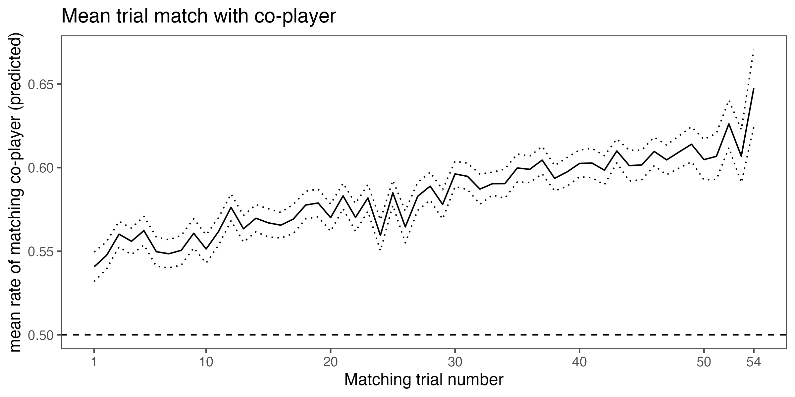
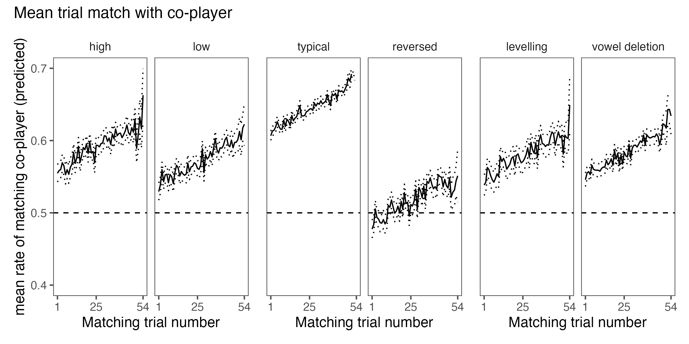
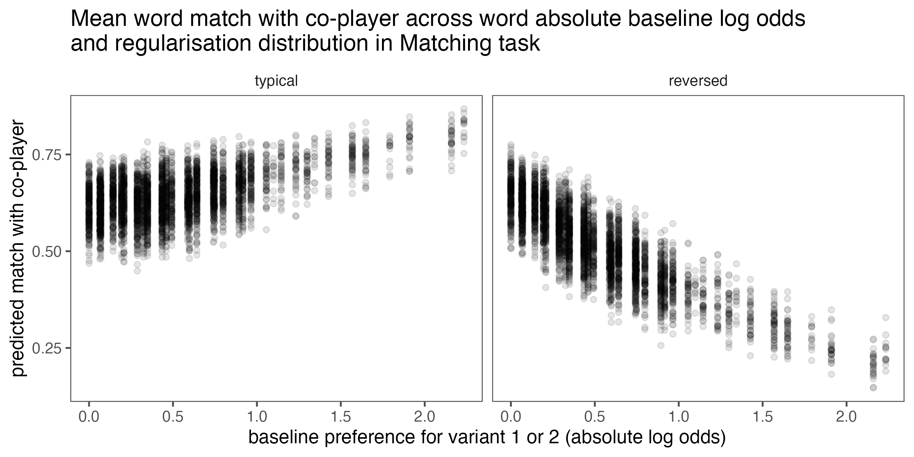
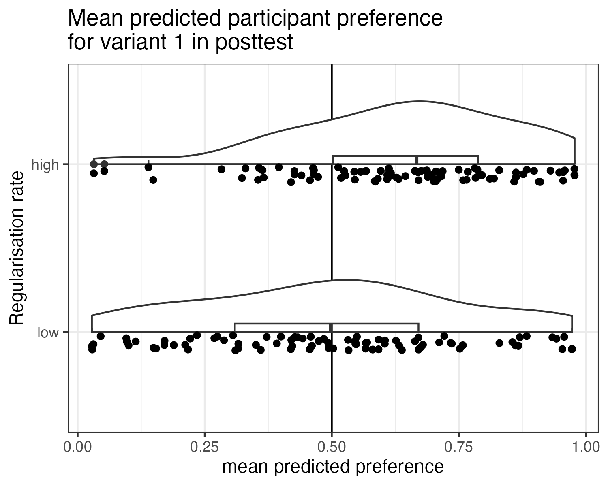
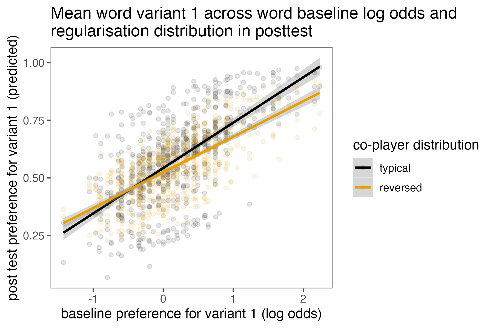
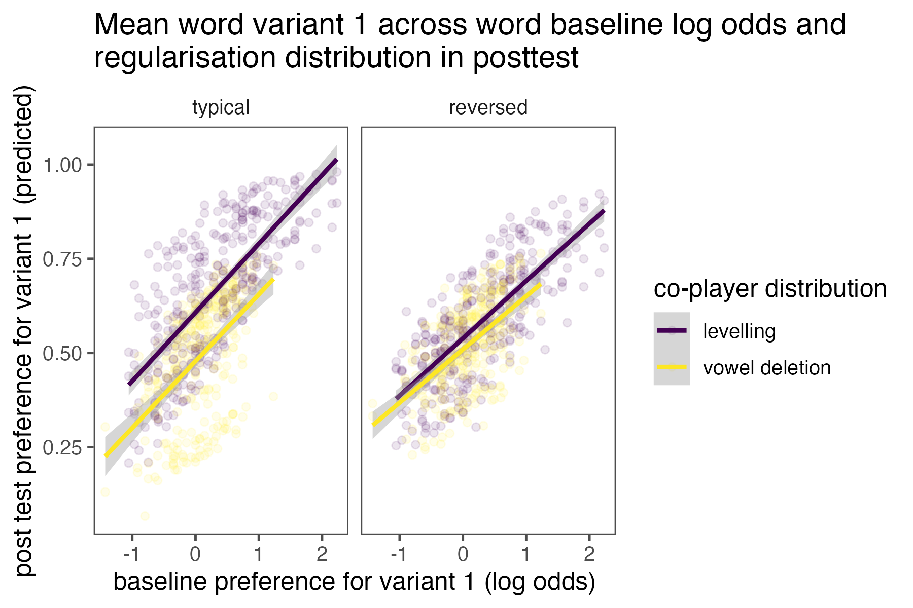

Supplementary Information: Learning Salient Morphological Variation
================
Rácz, Péter
2023-06-20

# Summary

We wanted to see whether people can learn morphological variation and
how the social salience of the pattern in question feeds into this. We
selected a set of variable patterns in Hungarian morphology, generated
nonce forms, benchmarked them in a baseline experiment, and then had our
participants play a word-matching game with an artificial co-player to
see whether they can learn from the co-player’s responses in the game
and adjust their representations of morphological variation.

Here, we give descriptions and report on the baseline experiment for
three variable patterns, levelling, vowel deletion, and front harmony.
We report on the matching game and provide a discussion for two of
these, levelling and vowel deletion.

The results confirm that participants have detailed representations of
variable patterns and are able to adjust these upon exposure to external
stimuli. Contrary to our expectations, this adjustment was not easier
for the socially salient morphological pattern.

# Structure

There were three experiments. All experiments were coded in javascript
and run remotely on the participant’s home computer. The workhorse of
the experiments was the written binary forced choice trial, in which you
see a written prompt and you have to finish it using one of two options.

The `baseline` experiment was used to benchmark the stimuli with one
sample of participants, so that we know that the participant pool
prefers variant 1 for word x but variant 2 for word y.

The `matching` experiment (referenced as `esp`, after “extra-sensory
perception”, in the file structure) was run with a second set of
participants. Its first half was a pretend game with a pretend second
player. The two of you have to pick the same ending for each prompt.
Since the second player is inflexible, you only succeed in the game if
you anticipate their responses. Its second half was similar to the
baseline experiment in that you have to pick options to finish prompts
by yourself. This is to check whether the patterns you learned in the
first half persist once the second player disappears.

The `integration` experiment was run with a third set of participants.
Its first part is the `matching` experiment, with the matching game and
the immediate post-test. It also involved a second post-test, after a
period of sleep.

The main questions of the paradigm are: Can people learn the
morphological variations fed to them in the matching game? Does this
knowledge persist and influence their responses in the immediate post
test? Does it persist and influence responses in the second post test,
after considerable time has passed?

# Stimuli

There are three sets of stimuli, variable patterns from Hungarian
morphology. `Baseline experiment` participants see examples from all
three. `Matching experiment` participants only see one set of stimuli
throughout.

## Sets of variation

We call the first variation `levelling`. It involves verbal inflection.
Hungarian inflects verbs with definite and indefinite objects
differently. The `1sg.pres.indef` of some verbs varies between the `-k`
inflectional suffix (which is the default for this exponent) and the
`-m` suffix (which is otherwise the `1sg.pres.def` suffix) – see
examples 1-4. Levelling is confined to one verb class (verbs that end in
`-ik` in the canonical form, the `3sg.pres.indef`) and one paradigm
slot, not appearing outside the `1sg.pres.indef`.

1)  **Nézem az almát.**  
    `watch.1sg.pres.def the apple.acc`  
    I watch the apple.

2)  **Nézek egy almát.**  
    `watch.1sg.pres.indef an apple.acc`  
    I watch an apple.

3)  **Eszem az almát.**  
    `eat.1sg.pres.def an apple.acc`  
    I eat the apple.

4)  **Eszek/eszem egy almát.**  
    `eat.1sg.pres.indef an apple.acc`  
    I eat an apple.

Many frequent verbs and many derivational suffixes are in the `-ik`
category, meaning that levelling is productive and applies to a large
number of frequent forms. It shows structured variation, sensitive to
derivational morphology, frequency, and form-based similarity. It has no
clear phonotactic or morphophonological triggers, any verb can end in
`-k` or `-m` (as they do otherwise in the `indef` and the `def`,
respectively). It is also has second-order indexicality: the
neutralising `-m` variant is seen as educated, “proper” use ([Rácz
2019](https://www.jstor.org/stable/26863550)).

A turn-of-the-century English analogy would be variation between `will`
and `shall` in the first person, where `shall` was seen as more formal
and educated but was also more likely to stand with certain more common
verbs rather than others: compare “We shall see.” with “I shall bicycle
home.”.

The second variation is called `vowel deletion`. It also involves verbal
inflection and is also confined to `-ik` verbs. These verbs end in two
possible templates: CCik and CVCik. In certain cases, the vowel is
deleted: Some verbs have a fixed CC template, others a fixed CVC
template. Some verbs vary between CC and CVC across different paradigm
slots (examples 5-6). Some verbs vary between CC and CVC in the same
paradigm slot (example 7). This can be different paradigm slots for
different verbs. Some instances of vowel deletion bring with themselves
a change in the second consonant (example 7). Some cases of variation
are lexicalised (example 8) ([Rácz, Rebrus, & Törkenczy
2018](https://www.degruyter.com/document/doi/10.1515/cllt-2018-0014/html)).

5)  **Felsöpör.**  
    `perf.sweep.3sg.pres.indef`  
    (S)he sweeps up.

6)  **Felsöpri.**  
    `perf.sweep.3sg.pres.def`  
    (S)he sweeps it up.

7)  **Nem tudják, mit cselekszenek/cselekednek.**  
    `neg know.2pl.pres.def what do.2pl.pres.indef`  
    They know not what they do.

8)  **Ma az áldozatokra emlékezünk/emlékszünk.**  
    `today the victim.pl.loc remember/commemorate.2pl.pres.indef`  
    Today we remember/honour the victims.

Variation is partly phonotactically and partly morphophonologically
motivated. Certain pairs of consonants cannot occur adjacently in the
stem unless they can be resyllabified, and this interacts with
restrictions on the linking vowel in the suffix. In some verbs, this
interaction leads to variable vowel deletion. In others, it cannot be
resolved and results in morphological defectivity ([Rebrus & Törkenczy
2009](https://www.researchgate.net/profile/Miklos-Toerkenczy/publication/299131111_Covert_and_overt_defectiveness_in_paradigms/links/56eee47608ae59dd41c7082b/Covert-and-overt-defectiveness-in-paradigms.pdf)).
While subject to some metalinguistic awareness, vowel deletion does not
carry any clear second-order indices and has not been discussed as a
sociolinguistic marker in Hungarian.

Vowel deletion in rapid speech can be observed in spoken English:
“family” or “natural” can be pronounced either as \[’f6mIlI\] or
\[’f6mlI\] and \[’n6t@r@l\] or \[’n6tr@l\]. This, however, is a
lower-level phenomenon, gradient, closely related to vowel stress, not
lexicalised, and not represented in the orthography.

The third variation is called `front harmony`. Hungarian has vowel
harmony: in most cases, the vowel in a suffix has to match the last
vowel in the stem in both frontedness and roundness (examples 9-10).
Some stem vowels are neutral, meaning that they do not determine the
suffix vowel: Vowel harmony “skips” them and matches the suffix vowel to
the preceding vowel in the stem (example 11). The vowel `e` is variably
neutral: a stem with a back vowel and `e` can select a front suffix
(agreeing with `e`) or a back suffix (skipping `e` and agreeing with the
preceding back vowel) (example 12).

9)  **fójerben**  
    `foyer.loc`  
    In the foyer.

10) **garázsnak**  
    `garage.dat` To the garage.

11) **partival**  
    `party.ins`  
    With the party.

12) **hotelra/hotelre**  
    `hotel.loc`  
    On the hotel.

Hungarian vowel harmony and its triggers of variation have seen
extensive scrutiny in the theoretical linguistics literature (see
e.g. (Hayes, Siptár, Zuraw, & Londe
2009)\[<https://www.jstor.org/stable/40492955>\]).

## Experimental stimuli

We compiled a frequency list from the morphologically disambiguated
(Hungarian Webcorpus 2)\[<https://hlt.bme.hu/en/resources/webcorpus2>\].
This was used to curate reference lists of existing forms for the three
variable sets
(scripts/build_words/build_real_list/build_real_word_lists/R). (In the
scripts, levelling is called `ik`, vowel deletion is called `ep`, and
front harmony is called `vh`.) The reference lists were generated by
creating variable forms by hand, and cross-referencing them with the
frequency list and a (spelling
dictionary)\[<https://github.com/laszlonemeth/magyarispell>\].

The next step was to use the reference sets to generate nonce forms for
each variable sets. Because both vowel deletion and front harmony
involve longer dependencies in the CV skeleton, off-the-shelf ngram
models were not sufficient to generate nonce forms. Instead, we wrote a
simple grammar to break up the words on the reference list to
syllable-based units and generate noun and verb forms and checked the
results by hand. The resulting lists were filtered so that each nonce
word in each set (levelling, vowel deletion, front harmony) had at an
edit distance of 2 or more with words in the reference set and with each
other (scripts/build_words/build_nonce/list/\*). Edit distance was based
on a phonemic transcription of contrastive segments (as the language has
digraphs in the orthography).

The final stimuli list was further restricted to vary across set
dimensions. For levelling, the paradigm slot was set: this variation is
restricted to `1sg.indef`. Each nonce form had a one or bisyllabic stem
and a derivational suffix. Hungarian verbs are a closed class, and new
verbs enter the language via derivational morphology, using one of
several possible derivational suffixes (see examples 13-15).

13) **guglizik**  
    `google.v.der.3sg.pres.indef`  
    (S)he googles.

14) **dúmozik**  
    `doom.v.der.3sg.pres.indef`  
    (S)he plays the video game Doom..v.der.3sg.pres.indef

15) **solymászik**  
    `falcon.v.der.3sg.pres.indef`  
    (S)he falcons.

A set of examples for levelling can be seen in Table 1.

| base      | variant1  | variant2  | derivational | nsyl | infl |
|:----------|:----------|:----------|:-------------|-----:|:-----|
| floglik   | floglok   | floglom   | -lik         |    1 | 1sg  |
| klivaslik | klivaslok | klivaslom | -lik         |    2 | 1sg  |
| bűtszik   | bűtszök   | bűtszöm   | -szik        |    1 | 1sg  |
| bivégszik | bivégszek | bivégszem | -szik        |    2 | 1sg  |
| spírzik   | spírzok   | spírzom   | -zik         |    1 | 1sg  |
| plövőrzik | plövőrzök | plövőrzöm | -zik         |    2 | 1sg  |

Table 1. Levelling: example stimuli

For vowel deletion, which occurs across many paradigm slots, variation
was restricted to the first, second, or third person of the plural
present indefinite. Otherwise, the structure was similar to levelling,
with mono- or bisyllabic stems and the same three derivational suffixes.
A set of examples for vowel deletion can be seen in Table 2.

| base                    | variant1     | variant2    | derivational | nsyl | infl |
|:------------------------|:-------------|:------------|:-------------|-----:|:-----|
| kléglik / klégezik      | kléglünk     | klégezünk   | -lik         |    1 | 1pl  |
| lűklik / lűközik        | lűklenek     | lűköznek    | -lik         |    1 | 2pl  |
| brüszlik / brüszözik    | brüszlötök   | brüszöztök  | -lik         |    1 | 3pl  |
| frivamlik / frivamozik  | frivamlunk   | frivamozunk | -lik         |    2 | 1pl  |
| trálaklik / trálakozik  | trálaklanak  | trálakoznak | -lik         |    2 | 2pl  |
| flüröklik / flüröközik  | flüröklötök  | flürököztök | -lik         |    2 | 3pl  |
| trálszik / trálodik     | trálszunk    | trálodunk   | -szik        |    1 | 1pl  |
| fökszik / föködik       | fökszenek    | föködnek    | -szik        |    1 | 2pl  |
| molszik / molodik       | molszotok    | molodtok    | -szik        |    1 | 3pl  |
| vehékszik / vehékedik   | vehékszünk   | vehékedünk  | -szik        |    2 | 1pl  |
| privékszik / privékedik | privékszenek | privékednek | -szik        |    2 | 2pl  |
| frálapszik / frálapodik | frálapszotok | frálapodtok | -szik        |    2 | 3pl  |
| csubzik / csubozik      | csubzunk     | csubozunk   | -zik         |    1 | 1pl  |
| trugzik / trugozik      | trugzanak    | trugoznak   | -zik         |    1 | 2pl  |
| sprigzik / sprigozik    | sprigzotok   | sprigoztok  | -zik         |    1 | 3pl  |
| nyivágzik / nyivágozik  | nyivágzunk   | nyivágozunk | -zik         |    2 | 1pl  |
| bratárzik / bratározik  | bratárzanak  | bratároznak | -zik         |    2 | 2pl  |
| klarágzik / klarágozik  | klarágzotok  | klarágoztok | -zik         |    2 | 3pl  |

Table 2. Vowel deletion: example stimuli

For front harmony, all stems were bisyllabic, with a back vowel and the
variable neutral vowel `e` or `é`. Many paradigm slots of the case
system show variation. Here, it was restricted to the inessive, the
dative, and the adessive case. A set of examples for front harmony can
be seen in Table 3.

| base     | variant1    | variant2    | vowel | decl |
|:---------|:------------|:------------|:------|:-----|
| dalenc   | dalencnál   | dalencnél   | e     | ad   |
| zihenc   | zihencnak   | zihencnek   | e     | dat  |
| szibed   | szibedban   | szibedben   | e     | in   |
| fágyép   | fágyépnál   | fágyépnél   | é     | ad   |
| klordény | klordénynak | klordénynek | é     | dat  |
| fájéz    | fájézban    | fájézben    | é     | in   |

Table 3. Front harmony: example stimuli

Three sets of 162 forms each were created, balancing across the
restrictions above. For each nonce word in each variable set, there are
two possible variant choices: `-k` or `-m` for levelling, `cc` (vowel
deleted) or `cvc` (vowel in situ) for vowel deletion, and back vowel or
front vowel in suffix for front harmony.

# Baseline experiment

## Stimuli

Each set of 162 stimuli were split to three lists. Each participant was
randomly given one list for each variable set (levelling, vowel
deletion, front harmony), 162 stimuli in total, in random order, not in
blocks. Each stimulus was embedded in a prompt that the participant had
to complete using one of two choices. The prompt was fixed across
variable set and inflectional or declension suffix. The prompt ending
unequivocally selects for a specific verb/noun complement. The two
variants of this complement are specified as the two alternatives in the
forced choice task. Example prompts can be seen in Table 4.

| prompt                                                    | variant1    | variant2    | gloss                                                         | variable set   |
|:----------------------------------------------------------|:------------|:------------|:--------------------------------------------------------------|:---------------|
| Te bizony sokat spröbzöl. Én is sokat…                    | spröbzök    | spröbzöm    | You do frequently VERB. I also frequently…                    | levelling      |
| János imád galározni, ezért sokat galárzik. Ők ritkán…    | galárzanak  | galároznak  | John loves to CVC VERB so he frequently CC VERB. They rarely… | vowel deletion |
| János imád dilakozni, ezért sokat dilaklik. Ti ritkán…    | dilaklotok  | dilakoztok  | John loves to CVC VERB so he frequently CC VERB. You rarely…  | vowel deletion |
| János imád flerékedni, ezért sokat flerékszik. Mi ritkán… | flerékszünk | flerékedünk | John loves to CVC VERB so he frequently CC VERB. We rarely…   | vowel deletion |
| Ez itt egy trikép. Ott vagyunk a…                         | triképban   | triképben   | This is a NOUN. We are there in the…                          | front harmony  |
| Ez itt egy hágyét. Elneveztem a kutyámat…                 | hágyétnak   | hágyétnek   | This is a NOUN. I named my dog…                               | front harmony  |
| Ez itt egy vismer. Nincs is jobb egy jó…                  | vismernál   | vismernél   | This is a NOUN. Nothing better than a good…                   | front harmony  |

Table 4. Example prompts across variation and suffix

## Participants

82 participants, 69 women, median age = 22 took part in the baseline
experiment in early 2022, participating for course credit.

## Procedure

The task was coded in
[psychojs](https://www.sciencedirect.com/science/article/pii/S0165027006005772)
and hosted on [Pavlovia](pavlovia.org). Participants were instructed
that they would see prompts that contain words that might be unfamiliar
to them. They were asked to pick a suffixed form to finish the prompt in
a way that seems most natural or familiar to them. They were informed
that different people might have different preferences and there are no
correct or incorrect answers. An example preceded the trials.
Participants used the keyboard to respond.

## Hypotheses

The aim of the task was to benchmark our stimuli. There were no starting
hypotheses on the distributions.

## Analysis

Participants who only picked the left button or the right button were to
be excluded from the data. No participants met this pre-registered
exclusion criterion.

## Results

Participants completed the task in a median 15.0747867 minutes. Given
the randomisation, the number of responses per nonce word was not the
same. Participants gave 26–29 responses to each nonce form, with a
median of 27.

For each nonce form, we calculated the log odds of the counts of
participants who picked variant 1 and those who picked variant 2.

## Data and code

Code used to set up and process the experiment is in
`scripts/baseline_exp`. The code to run the experiment is in
`interface/hesp_baseline.zip`. Raw data are in `exp_data/raw`, tidy data
are in `exp_data/baseline`.

## Ethics

Participants gave informed consent at the beginning of the experiment.
The study was approved by the United Ethical Review Committee for
Research in Psychology in Hungary (EPKEB, ref. number 2021-119).

# Matching experiment

The sample size, design, exclusion criteria, and data analysis were
[pre-registered](https://aspredicted.org/BL1_S7V). We only report the
levelling and vowel deletion data.

## Stimuli

The matching game is played with a co-player and the participant has to
match the way the co-player would finish the prompt. By manipulating the
co-player’s responses, we can feed different morphological distributions
to the participant. The post test has the participant playing alone, in
order to ascertain whether they persist in patterns they learned in the
matching game. One participant sees words from one type of variation
only (levelling / vowel deletion / front harmony), both in the matching
game and the post test. One participant sees different words in the
matching game and in the post test.

We created three lists of 54 items each for each variation, sampled from
the baseline. In each list, nonce forms were ranked from 1 (largest
baseline preference for variant 1) to 54 (largest baseline preference
for variant 2). Co-players used the baseline patterns as a reference.
They diverged from them across two dimensions.

Co-players had a **high** rate of use for variant 1 (and,
correspondingly, a low rate of use for variant 2) or a **low** rate of
use for variant 1 (and a high rate for variant 2). **High** meant they
picked variant 1 in 39/54 trials (72%). **Low** meant they picked
variant 1 in 15/54 trials (28%).

Co-players didn’t pick forms at random. The lists were sorted according
to rank, going from words that showed the highest preference for variant
1 to those that showed the lowest preference for variant 1. One set of
co-players picked the first 39 forms (in the **high** condition) or the
first 15 forms (in the **low** condition) and then went on to choose
variant 1 for these. This meant that these co-players acted like our
average baseline participant, apart from having a quantitative
preference for lots of variant 1 or few of variant 1. These were
**typical** co-players.

Another set of co-players reversed the list and chose variant 1 for the
words that were least likely to select it in the baseline. Effectively,
these co-players gave responses that were the opposite of the
expectations of an average baseline participant. These were **reversed**
co-players.

Table 5 illustrates this. It shows the items on list 1 for the levelling
set, sorted from strongest preference for variant 1 (“tomlik”) to
strongest preference for variant 2 (“spilágzik”). A co-player with
**high** preference for variant 1 and a **typical** distribution will
pick the first variant, `-k` for the first 39 verbs and the second
variant, `-m`, for the last 15. A co-player with **low** preference for
variant 1 and a **typical** distribution will pick `-k` for the first 15
verbs and `-m` for the last 39. A co-player with **high** preference for
`-k` and a **reversed** distribution will use the list upside-down and
pick `-k` for the last 39 verbs and `-m` for the first 15 verbs. A
co-player with **low** preference for `-k` and a **reversed**
distribution will pick `-k` for the last 15 verbs and `-m` for the first
39 verbs.

| baseline rank | base       | high typical   | low typical    | high reversed  | low reversed   |
|--------------:|:-----------|:---------------|:---------------|:---------------|:---------------|
|             1 | tomlik     | tomlo**k**     | tomlo**k**     | tomlo**m**     | tomlo**m**     |
|             2 | fibamlik   | fibamlo**k**   | fibamlo**k**   | fibamlo**m**   | fibamlo**m**   |
|             3 | femlik     | femle**k**     | femle**k**     | femle**m**     | femle**m**     |
|             4 | feténylik  | fetényle**k**  | fetényle**k**  | fetényle**m**  | fetényle**m**  |
|             5 | spűmlik    | spűmlö**k**    | spűmlö**k**    | spűmlö**m**    | spűmlö**m**    |
|             6 | sztremlik  | sztremle**k**  | sztremle**k**  | sztremle**m**  | sztremle**m**  |
|             7 | pratánylik | pratánylo**k** | pratánylo**k** | pratánylo**m** | pratánylo**m** |
|             8 | spéslik    | spésle**k**    | spésle**k**    | spésle**m**    | spésle**m**    |
|             9 | flagánylik | flagánylo**k** | flagánylo**k** | flagánylo**m** | flagánylo**m** |
|            10 | jüslik     | jüslö**k**     | jüslö**k**     | jüslö**m**     | jüslö**m**     |
|            11 | büglik     | büglö**k**     | büglö**k**     | büglö**m**     | büglö**m**     |
|            12 | prűrlik    | prűrlö**k**    | prűrlö**k**    | prűrlö**m**    | prűrlö**m**    |
|            13 | ruslik     | ruslo**k**     | ruslo**k**     | ruslo**m**     | ruslo**m**     |
|            14 | marzik     | marzo**k**     | marzo**k**     | marzo**m**     | marzo**m**     |
|            15 | brüjlik    | brüjlö**k**    | brüjlö**k**    | brüjlö**m**    | brüjlö**m**    |
|            16 | csíszlik   | csíszlo**k**   | csíszlo**m**   | csíszlo**k**   | csíszlo**m**   |
|            17 | flüröslik  | flüröslö**k**  | flüröslö**m**  | flüröslö**k**  | flüröslö**m**  |
|            18 | szirlik    | szirlo**k**    | szirlo**m**    | szirlo**k**    | szirlo**m**    |
|            19 | klörlik    | klörlö**k**    | klörlö**m**    | klörlö**k**    | klörlö**m**    |
|            20 | nyáslik    | nyáslo**k**    | nyáslo**m**    | nyáslo**k**    | nyáslo**m**    |
|            21 | pebzik     | pebze**k**     | pebze**m**     | pebze**k**     | pebze**m**     |
|            22 | juszlik    | juszlo**k**    | juszlo**m**    | juszlo**k**    | juszlo**m**    |
|            23 | klibamlik  | klibamlo**k**  | klibamlo**m**  | klibamlo**k**  | klibamlo**m**  |
|            24 | tínylik    | tínylo**k**    | tínylo**m**    | tínylo**k**    | tínylo**m**    |
|            25 | bölszik    | bölszö**k**    | bölszö**m**    | bölszö**k**    | bölszö**m**    |
|            26 | flűröklik  | flűröklö**k**  | flűröklö**m**  | flűröklö**k**  | flűröklö**m**  |
|            27 | trilszik   | trilszo**k**   | trilszo**m**   | trilszo**k**   | trilszo**m**   |
|            28 | böjzik     | böjzö**k**     | böjzö**m**     | böjzö**k**     | böjzö**m**     |
|            29 | sűzlik     | sűzlö**k**     | sűzlö**m**     | sűzlö**k**     | sűzlö**m**     |
|            30 | hilarzik   | hilarzo**k**   | hilarzo**m**   | hilarzo**k**   | hilarzo**m**   |
|            31 | spibaklik  | spibaklo**k**  | spibaklo**m**  | spibaklo**k**  | spibaklo**m**  |
|            32 | tiregzik   | tiregze**k**   | tiregze**m**   | tiregze**k**   | tiregze**m**   |
|            33 | fretszik   | fretsze**k**   | fretsze**m**   | fretsze**k**   | fretsze**m**   |
|            34 | narjárzik  | narjárzo**k**  | narjárzo**m**  | narjárzo**k**  | narjárzo**m**  |
|            35 | spatárzik  | spatárzo**k**  | spatárzo**m**  | spatárzo**k**  | spatárzo**m**  |
|            36 | málapszik  | málapszo**k**  | málapszo**m**  | málapszo**k**  | málapszo**m**  |
|            37 | lorjódzik  | lorjódzo**k**  | lorjódzo**m**  | lorjódzo**k**  | lorjódzo**m**  |
|            38 | ribegzik   | ribegze**k**   | ribegze**m**   | ribegze**k**   | ribegze**m**   |
|            39 | flagárzik  | flagárzo**k**  | flagárzo**m**  | flagárzo**k**  | flagárzo**m**  |
|            40 | frilegszik | frilegsze**m** | frilegsze**m** | frilegsze**k** | frilegsze**k** |
|            41 | sprökszik  | sprökszö**m**  | sprökszö**m**  | sprökszö**k**  | sprökszö**k**  |
|            42 | brágaklik  | brágaklo**m**  | brágaklo**m**  | brágaklo**k**  | brágaklo**k**  |
|            43 | prilegzik  | prilegze**m**  | prilegze**m**  | prilegze**k**  | prilegze**k**  |
|            44 | drubódzik  | drubódzo**m**  | drubódzo**m**  | drubódzo**k**  | drubódzo**k**  |
|            45 | siladzik   | siladzo**m**   | siladzo**m**   | siladzo**k**   | siladzo**k**   |
|            46 | sojzik     | sojzo**m**     | sojzo**m**     | sojzo**k**     | sojzo**k**     |
|            47 | piragszik  | piragszo**m**  | piragszo**m**  | piragszo**k**  | piragszo**k**  |
|            48 | driládzik  | driládzo**m**  | driládzo**m**  | driládzo**k**  | driládzo**k**  |
|            49 | ribzik     | ribzo**m**     | ribzo**m**     | ribzo**k**     | ribzo**k**     |
|            50 | herégszik  | herégsze**m**  | herégsze**m**  | herégsze**k**  | herégsze**k**  |
|            51 | sprogzik   | sprogzo**m**   | sprogzo**m**   | sprogzo**k**   | sprogzo**k**   |
|            52 | vilakszik  | vilakszo**m**  | vilakszo**m**  | vilakszo**k**  | vilakszo**k**  |
|            53 | pivegszik  | pivegsze**m**  | pivegsze**m**  | pivegsze**k**  | pivegsze**k**  |
|            54 | spilágzik  | spilágzo**m**  | spilágzo**m**  | spilágzo**k**  | spilágzo**k**  |

Table 5. Levelling list 1 across co-player types

The matching experiment has a post test to check whether the participant
maintains the patterns learned in the matching game. Participants were
allocated to lists and conditions at random. If a participant had list
1/2/3 in the matching game, they had list 2/3/1 in the post test.

There were three lists and all four co-player types played all lists,
resulting in 12 unique lists in total. The pre-registration specifies 50
trials, the experiment had 54 trials.

Participants saw words in a random order in both the matching game and
the post test. The order of variants in each trial was also randomised.

## Participants

182 participants completed the matching experiment in late 2022 and
early 2023. Sample size was pre-set to 7 per unique list (12 lists) or
21 per condition (high / low x typical / reversed x levelling / vowel
deletion). 5participants who matched our exclusion criteria (see below)
were excluded. Then, we kept data from the first seven participants in
each list (excluding an additional 9 participants), resulting in a final
total of 7 x 3 x 2 x 2 x 2 = 168 participants, 111 women. Median age was
22. Participants completed the task for course credit.

## Procedure

The task was coded in [jspsych](jspsych.org) and hosted on Pavlovia.
Participants were instructed that they would see prompts that contain
words that might be unfamiliar to them. They were asked to pick a
suffixed form to finish the prompt in a way that seems most natural or
familiar to them. They were informed that different people might have
different preferences and there are no correct or incorrect answers. An
example preceded the trials. Participants used the keyboard to respond.

Participants were also instructed that they play this game with another
player. The other player always has the same options as them. Their
joint task is to choose the same option in each trial. Participants were
instructed that, in order to do so, they have to pay attention to the
other player’s answers and guess how they will choose next. If they get
it right, they get a point.

After an example trial, participants were informed that they would be
connected to the other player. This was followed by a delay of circa
five seconds during which the message “connecting to the other player…”
was seen on the screen, followed by a brief message saying “connection
successful”.

Each matching game trial had the same forced-choice format as the
baseline task, except that, instead of the keyboard, participants had to
click on buttons to make a choice. In each trial, the other player would
“think” for a random interval within 3-9 seconds, during which the
message “the other player is thinking” was visible above the trial
prompt. If the participant made a choice during this time, they had to
wait for the other player to “finish” the trial. If the participant did
not make a choice during this time, the message “the other player made a
choice” became visible. Once the participant made their choice, they
were informed about the co-player’s choice and whether it matched their
own choice. A match was rewarded with a green tick and the message “you
matched the other player”. A mismatch was rewarded with a red X and the
message “you did not match the other player”. In addition, a match
awarded a point and the current score of the player and the co-player
was displayed on the screen.

After the matching game, the participant was instructed to do the same
task, to finish prompts, but, this time, without the co-player. Once the
participant finished this post test, a message informed them of their
final score. Score had no effect on the game or on participant
compensation.

## Hypotheses

We expected people to (1) learn in the matching game and become better
at predicting the co-players answers. We expected (2) learning to
persist in the post test so that patterns in the post test are similar
to patterns in the matching game. We expected that (3) learning will be
easier and persistent effects stronger for the socially salient
variation, levelling, as compared to vowel deletion.

We do not know the priors of the participants. Some of them likely have
a high or low preference for variant 1 themselves. We do know the priors
for the target words, based on the baseline task.

In terms of (1) learning, we can see how well participants converge to
various co-players across levelling or vowel deletion stimuli. In terms
of (2) persistent effects, we can look at differences in post test
responses across target words and participants in the various co-player
conditions (high / low, typical / reversed, levelling / vowel deletion).

## Analysis

Participants who only picked the left button or the right button were to
be excluded from the data. No participants met this pre-registered
exclusion criterion. Participants whose finished either the matching
game or the post test slower than the median completion time plus three
times the mean absolute deviation of completion times were excluded.
Individual trials that had a longer response time than the median
response time plus three times the mean absolute deviation of response
times were also excluded. Median and mean absolute deviation were
calculated separately for type of variation (levelling / vowel deletion)
and phase (matching game or post test).

1255 trials or 6.9168871% of all trials were dropped. This is a
relatively high number. This is likely both because the task was
difficult and because participants completed it in an uncontrolled
environment, both contributing to higher variability. Participants
completed the matching game and the post test in 10-15 minutes.

### Matching game

We fit a generalised additive mixed model ([Wood
2023](https://cran.r-project.org/web/packages/mgcv/index.html)) on the
matching data. The outcome variable was agreement with the co-player.
The predictors were trial index, rate of use of variant 1 (high / low),
distribution of use of variant 1 (typical / atypical), type of variation
(levelling / vowel deletion), and the log odds of the number of variant
1 and variant 2 responses to the target form in the baseline task.
Grouping factors were participant and target form. Models were fit using
restricted maximum likelihood, a binomial error distribution, and a
logit link function. We did not drop terms and instead explored all
interactions and used goodness-of-fit tests and AIC for model comparison
([van Rij
2022](https://www.rdocumentation.org/packages/itsadug/versions/2.4.1)).

The best model had a linear effect of trial index and a quadratic effect
of baseline log odds of variant 1 / variant 2. Random smooths did not
improve model fit. We re-fit it as a generalised linear mixed model with
a linear effect of trial index and a linear effect of the absolute
baseline log odds of variant 1 and variant 2. We report this model
below.

### Post test

We fit a generalised linear mixed model ([Bates
2023](https://cran.r-project.org/web/packages/lme4/index.html)) on the
post test data. The outcome variable was agreement with the co-player.
The predictors were rate of use of variant 1 (high / low), distribution
of use of variant 1 (typical / atypical), type of variation (levelling /
vowel deletion), and the log odds of the number of variant 1 and variant
2 responses to the target form in the baseline task. Grouping factors
were participant and target form. Models were fit using restricted
maximum likelihood, a binomial error distribution, and a logit link
function. The post test analysis was pre-registered. Grouping factors
were participant and target form. Models were fit using maximum
likelihood, a binomial error distribution, and a logit link function. We
did not drop terms and isntead explored all interactions and used
goodness-of-fit tests, AIC, and Bayes Factors for model comparison. We
used the performance package ([Lüdecke
2023](https://cran.r-project.org/web/packages/performance/index.html))
to check model health and to compare models.

The model of the matching data was largely explorative. The model of the
post test data was pre-registered, down to interactions and random
effect structure, with the notable difference that the final analysis
uses frequentist, rather than Bayesian methods. The main advantage of
Bayesian statistics is that frequentist models often result in errors of
magnitude by overfitting the data. The use of pre-registered sample
size, exclusion criteria, and model structure, along with Bayes Factors
to detect overfitting, largely mitigates this problem.

The best model had an interaction of baseline log odds and co-player
typicality. Random slopes did not improve this model. We report this
model below.

## Results

### Matching game

The formula for the best model is
`match ~ 1 + reg_rate + reg_dist * scale(abs_baseline_log_odds_jitter) + variation + scale(i) + (1|part_id) + (1|base)`.
The outcome is the probability of matching the co-player. The summary of
the fixed effects is in Table 6.

| term                                                  | estimate | std.error | statistic | conf.low | conf.high |
|:------------------------------------------------------|---------:|----------:|----------:|---------:|----------:|
| Intercept                                             |     0.69 |      0.06 |     10.90 |     0.56 |      0.81 |
| rate of v1: low                                       |    -0.08 |      0.06 |     -1.31 |    -0.19 |      0.04 |
| typicality reversed                                   |    -0.54 |      0.06 |     -9.18 |    -0.66 |     -0.43 |
| abs. baseline log odds (scaled)                       |     0.16 |      0.04 |      4.01 |     0.08 |      0.23 |
| variation: vowel deletion                             |    -0.08 |      0.07 |     -1.14 |    -0.21 |      0.06 |
| trial number (scaled)                                 |     0.08 |      0.02 |      3.67 |     0.04 |      0.13 |
| typicality reversed : abs. baseline log odds (scaled) |    -0.58 |      0.05 |    -11.67 |    -0.67 |     -0.48 |

Table 6. Best model, ESP matches

The intercept is above zero with a 95% confidence interval that excludes
zero. This means that participants are, overall, above chance in
matching the co-player in the 54 trials of the matching phase. Of the
predictors, trial number, reversed co-player typicality and item
baseline log odds have a significant effect on match success. We now
look at these in detail.

Figure 1 shows the rate of mean predicted match per trial in the
matching game. The dotted lines are standard errors. We see that, at the
beginning, participants have about a 55% chance of matching the
co-player – above chance – and this gradually improves during the game,
reaching about 65% towards the final trial.

<figure>

<figcaption aria-hidden="true">Figure 1</figcaption>
</figure>

This shows that participants learn in the matching game. They are more
likely to match the co-player in the end than in the beginning. Learning
has a linear trajectory. The data do not support a non-linear learning
trajectory nor across-participant variation in the shape of the learning
trajectory. Participants have different random intercepts. Various
conditions have meaningfully different fixed intercepts. The trajectory
and the linearity of learning is always the same.

This is shown in Figure 2, which shows mean predicted match across trial
number in three splits: high / low use of variant 1 (left), typical or
reversed co-player distribution (middle), and matching in levelling or
vowel deletion stimuli (right).

<figure>

<figcaption aria-hidden="true">Figure 2</figcaption>
</figure>

Looking at the left-hand side, learning is not harder with either a high
or low rate of variant 1.

Looking at the middle, the only statistically significant difference is
between the intercepts of matching a typical versus a reversed
co-player. Matching a typical co-player is much easier right from the
beginning. In contrast, participants are less likely than chance to
match the reversed co-player initially. This demonstrates that learning
goes beyond picking up on a rate of use for variant 1 / variant 2. If a
co-player’s choices reflect the baseline distribution of preference for
variant 1 / variant 2, participants are much more likely to match the
co-player right away. This then improves, likely because participants
can adjust their expectations on the rate of use for variant 1 (high or
low) on top of the typical distribution.

In contrast, when a co-player’s choices are counter-intuitive,
participants start out mismatching the co-player. They then gradually
adjust to the co-player’s distribution, resulting in some improvement in
matching.

We think it possible that learning trajectories are not completely
linear in real life, in which case the data do not provide us with
enough evidence to reject linearity. At the same time, word-level
distributions in both the matching game and the post test also suggest
gradual convergence with the co-player across trials and lexical items.

Looking at the right-hand side, we see that learning is not less
difficult with the socially more salient variable set, levelling.
Despite the clear second-order indices of levelling and the relative
heterogeneity of vowel deletion, participants are equally capable of
picking them up.

One interaction in the model is between the baseline log odds of the
target word in the prompt and co-player typicality. This can be seen in
Figure 3. The horizontal axis shows the absolute log odds of picking
variant 1 in the baseline. If this number is near zero, baseline
participants showed no strong preference for variant 1 or variant 2
(since the plogis of 0 is .5). If it is a large number, baseline
participants showed a strong preference for variant 1 (a large positive
log odds) or variant 2 (a large negative log odds). The vertical axis is
the predicted probability of matching a co-player in the matching game.

When we look at the left-hand panel, we see how these two correlate when
playing a typical co-player. All we see here is a reflection of the
design: both high and low co-players pick variant 1 for words where
variant 1 is strongly preferred in the baseline, and the same is true
for variant 2, so matching words with high absolute baseline log odds is
easier.

When we look at the right-hand panel, we see a different pattern emerge
when playing a reversed co-player. If the absolute baseline log odds of
a word is a high value, that means it has a clear preference for variant
1 or variant 2. Conversely, the reversed co-player will pick the
opposite variant. Matching the reversed co-player, then, will be harder.
This, again, shows that participants have word-level expectations on
whether variant 1 or variant 2 is more “appropriate”. A co-player that
respects these expectations is easier to match. A co-player that
violates them is harder to match. Here again we see a linear trajectory:
for any given word, the larger the baseline preference for variant 1 or
variant 2, the harder it is to match a reversed co-player’s pick.

<figure>

<figcaption aria-hidden="true">Figure 3</figcaption>
</figure>

The results show that matching becomes easier in the course of the
matching game and that reversed co-players are harder to match than
typical ones, demonstrating an effect of word-level expectations (above
and beyond overall expectations on the rate of use for variant 1 or
variant 2). Curiously, learning is not easier with the socially salient
variable set.

### Post test

The best model for the post test is
`picked_v1 ~ 1 + reg_rate + reg_dist * baseline_log_odds_jitter + variation + (1 + 1|part_id) + (1|base)`.
Since there is no co-player here to match, the outcome is the probabilty
of picking variant 1. The summary of the fixed effects is in Table 7.

| term                                                  | estimate | std.error | statistic | conf.low | conf.high |
|:------------------------------------------------------|---------:|----------:|----------:|---------:|----------:|
| Intercept                                             |     0.93 |      0.25 |      3.74 |     0.44 |      1.41 |
| rate of v1: low                                       |    -0.83 |      0.25 |     -3.39 |    -1.32 |     -0.35 |
| typicality reversed                                   |    -0.05 |      0.25 |     -0.22 |    -0.54 |      0.43 |
| baseline log odds                                     |     1.09 |      0.07 |     14.59 |     0.94 |      1.23 |
| variation: vowel deletion                             |    -0.53 |      0.25 |     -2.11 |    -1.02 |     -0.04 |
| typicality reversed : abs. baseline log odds (scaled) |    -0.19 |      0.09 |     -2.06 |    -0.37 |     -0.01 |

Table 7. Best model, ESP matches

The intercept is above zero and the effect of low co-player rate of use
of variant 1 is negative. This means that participants use a high amount
of variant 1 in the post test if they played a high-variant 1 co-player
and a low amount if they played a low co-player. Target word baseline
log odds of use of variant 1 is a strong predictor of post test use of
variant 1, which makes sense. Otherwise, since the outcome is use of
variant 1, we do not expect co-player typicality and variable set to
have a single term effect. We are interested in interactions between
terms. The one significant interaction is between target word baseline
log odds of use of variant 1 and co-player typicality. We explore this
below.

Essentially, participants maintain the patterns they learned in the
matching phase. A clear example of this is that participants who played
a high-variant 1 co-player will have a higher use of variant 1 in the
post test than those who played a low-variant 1 co-player. This can be
seen in Figure 4, which plots the distribution of mean predicted
participant preference for variant 1 in the post test for participants
who played a high variant 1 co-player (above) or a low variant 1
co-player (below).

<figure>

<figcaption aria-hidden="true">Figure 4</figcaption>
</figure>

The persistent adjustment goes beyond a shift in the rate of use of
variant 1 and variant 2. This can be seen in Figure 5. The horizontal
axis shows the baseline log odds of the use of variant 1 for each word
and the vertical axis shows the mean predicted rate of use of variant 1
in the post test. The two are correlated: participants in the post test
make similar choices to participants in the baseline experiment.

The strength of the correlation is significantly different depending on
the type of co-player in the matching game: the choices of participants
playing a reversed co-player have a weaker correlation with the baseline
pattern. This is because we exposed these participants to a different
lexical structure. Participants playing a typical co-player received
evidence that supports their own lexical structure. Participants playing
a reversed co-player received evidence that words that, in their
judgement, strongly prefer variant 1 in fact strongly prefer variant 2,
and those that strongly prefer variant 2 in fact strongly prefer
variant 1. As a result, these participants adjusted their lexical
patterns. Words that otherwise have a low preference for variant 1 now
have a higher preference. Words that otherwise have a high preference
for variant 1 now have a lower preference. The result is the difference
in the rates of correlation, seen in Figure 5.

<figure>

<figcaption aria-hidden="true">Figure 5</figcaption>
</figure>

This effect is independent of whether the co-player had a high or low
overall preference for variant 1. This also makes sense: half of the
participants have seen a co-player with a high overall rate of variant 1
and half of the participants have seen a co-player with a low overall
rate of variant 1 and the two groups average out. More interestingly,
the variable set also makes no difference. This can be seen in Figure 6.

Figure 6 shows the correlation of baseline log odds with predicted mean
rate of use of variant 1 in the post test for each word, this time split
across participants with typical and reversed co-players. The slope of
the correlation is not different between participants who were exposed
to levelling stimuli versus vowel deletion stimuli, either for the
typical or the reversed co-player. This means that not only are the
rates of learning similar for the two variable sets, the learned lexical
structure is retained to a similar extent in the post test.

<figure>

<figcaption aria-hidden="true">Figure 6</figcaption>
</figure>

## Discussion

We reported results of an experiment in which we expose participants to
a pattern of variation which is expressed over benchmarked nonce word
stimuli but is based on existing variation in their native language. We
do so using a matching game in which they have to agree with an
artificial co-player in picking one variant out of two for a
morphological exponent. Both variants are well-formed according to the
rules of the language. The co-player made decisions based partly on
patterns in the ambient language and partly based on condition-based
manipulations. Participants were incentivised to learn variation and the
question was whether its various attributes make it easier or harder for
them to do so.

Our participants learned the variable patterns. They improved in
agreeing with the co-player over the course of the matching game and
their subsequent post test responses sorted them in groups depending on
what sort of co-player they had just seen. Learning did not solely
consist of adjusting the rate of use for this or that variant but rather
responded to the distribution of variants used by the co-player.
Participants picked a specific variant for target words if these looked
like target words that the co-player had used with a specific variant,
even when they no longer played the co-player.

Participants played our matching game using one of two distinct types of
variation in Hungarian verbal inflection. One, levelling, is systematic
and socially salient, the other, vowel deletion, is heterogeneous and
has no clear metalinguistic or social indices. Despite this difference,
participants readily learned both patterns.

There are two alternate explanations of the data. First, things might be
simpler. There might be no real interaction between target word baseline
log odds and co-player typicality in the post test. This would mean that
participants only adjust their rate of use of variant 1 but do not
otherwise learn from the co-player. This is less likely both because we
see a reversed co-player effect, independent of rate of use, in the
matching game itself and because model comparison finds the complexity
of the interaction justified: this model is a better fit and it is more
predictive. Second, things might be more complicated. There might be a
three-way interaction between word baseline log odds, co-player
typicality, and type of variation in the post test. For these data, this
would show that meaningful convergence is only observed for the
levelling set, not for the vowel deletion set. This would be in line
with our expectations based on how the levelling set is more socially
salient. This model is a better fit on the data and has a lower AIC, but
a comparison of BIC values (the Bayes Factor) strongly indicates that
its complexity is not justified. Neither do we see an effect of type of
variation in the matching game. While the matching game and the post
test spotlight different mechanisms and, indeed, the respective models
predict different things (matching with the co-player; picking variant
1). We would still expect them to pattern together, which is a part of
the justification for selecting the best model.

The paradigm had some limitations. Interaction was written, rather than
spoken, the number of choices was pre-set, and variation was defined
over a large number of unique nonce words, rather than a smaller number
of existing words. Participants had no representation of the co-player,
who remained an ill-defined, stripped-down social presence. The analysis
of the matching game was explorative. The analysis of the post test was
pre-registered along with the design and the sample size, minimising
researcher degrees of freedom. This makes the absence of a difference
between levelling and vowel deletion all the more remarkable.

Beyond the absence of a salience effect, the results are interesting as
a replication of complex morphological convergence in an interaction.
The only other study of morphological convergence ((Rácz Beckner Hay
Pierrehumbert
2020)\[<https://www.linguisticsociety.org/sites/default/files/02_96.4Racz.pdf>\])
used this paradigm. The main difference there was the use of the English
past tense as the target variable distribution. The English past tense
is a well-understood piece of variable inflectional morphology. At the
same time, it contains a range of competing sets of variation, it is
restricted to a small number of forms, and it shows extremely limited
productivity in natural language. In contrast, both levelling and vowel
deletion are fully productive, widely attested patterns in Hungarian.
Attesting morphological convergence in Hungarian inflectional morphology
lends further credence to the notion that such convergence is both
possible and based on adjustments in rich lexical representations.

## Data and code

Code used to set up and process the experiment is in `scripts/esp_exp`.
The code to run the experiment is in `interface/hesp.zip`. Code to fit
models is in `analysis/esp_analysis/esp_analysis.R`. Code to visualise
data is in `analysis/esp_analysis/esp_pred_viz.R`. Raw data are in
`exp_data/raw`, tidy data are in `exp_data/baseline`.
